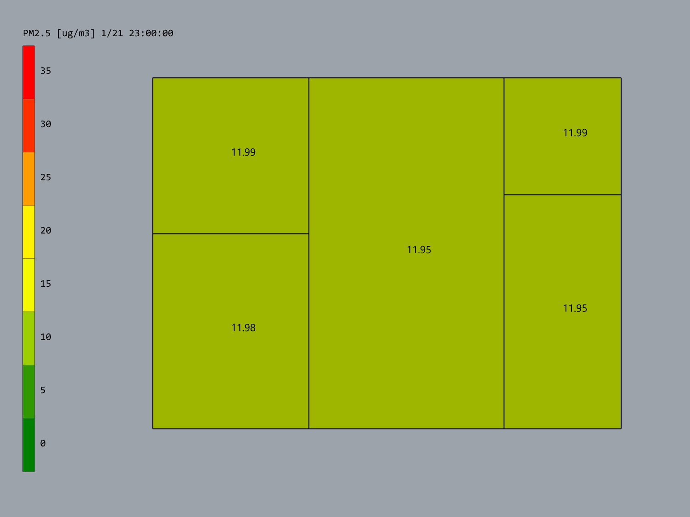

# ANT
 
 
<!--ts-->
 - [Introduction](#introduction)
 - [Installation](#installation)
 - [Tutorials](#tutorials)
 - [Example cases](#example-cases)
<!--te-->

# Introduction
ANT is a multizone indoor air quality (IAQ) and ventilation analysis plug-in on Rhino Grasshopper. ANT integrates the functions of programs in [CONTAM](https://www.nist.gov/el/energy-and-environment-division-73200/nist-multizone-modeling/software) family, including **CONTAMW**, **CONTAM Weather File Creator**, **CONTAM Particle Distribution Calculator**, **FaTIMA**, **CONTAM Results Viewer**, and **CONTAM Results Export Tool**, which allows ANT to perform analyses of 
 - multizone airflow and contaminant transport, 
 - occupant exposure to indoor contaminants,
 - estimation of transmission and infection risk of respiratory diseases, and
 - visualization of contaminant and exposure modelings.

CONTAM is a program (family) developed by NIST to accomplish multizone IAQ and ventilation analyses. ContamP and ContamX APIs were used in ANT to develop GH components to create CONTAM project elements (such as zones, paths, air handling system, and occupancy), generate project files (.prj) and run simulations. The original CONTAM and associated tools can be found on [NIST website](https://www.nist.gov/el/energy-and-environment-division-73200/nist-multizone-modeling/software) and a Python wrapper for ContamX (CONTAM simulation engine) is available on [PyPI](https://pypi.org/project/contamxpy/).

 

The name "ANT" originates from "**contam**in**ant**" (or "**contam**-in-**ant**"). It implies the link between CONTAM and ANT, but also embodies the mission of ANT. Besides the regular functions of CONTAM, the highlighted features of ANT mainly include
 - capability of establishing straightforward and realistic 3D building/room models for CONTAM analyses (compared to the conventional way of drawing 2D models on the sketchpad within CONTAMW),
 - simplified approaches on creating CONTAM zones and paths,
 - logistic and intuitive connections among components,
 - access to U.S. EPA's Air Quality System (AQS) [database](https://aqs.epa.gov/aqsweb/documents/data_api.html) to generate ambient contaminant files (.ctm) for typical atmospheric contaminants in U.S. cities,
 - estimation of contaminant exposures and disability-adjusted life years ([DALYs](https://doi.org/10.1897/2004-007R.1)),
 - calculation of multizone airborne transmission and infection estimation for respiratory diseases (e.g. COVID-19), and
 - visualization of contaminant and exposure calculations through plots, contours, and animations. 

# Installation
1. Download and unzip ANT from [Food4Rhino](https://www.food4rhino.com/en/app/ant) 
2. Place the **entire ANT folder** (including .gha and other dependencies) under Grasshopper's **Components Folder** (via Grasshopper - File - Special Folders). *(In Windows, the Components Folder is located under "%Appdata%\Roaming\Grasshopper\Libraries")*

# Support Forum
 - [Google Group of ANT](https://groups.google.com/g/contam-ant)

# Tutorials
[0 - Elements and Structure of ANT](./tutorials/0%20-%20Elements%20and%20Structure%20of%20ANT.md)

[1 - Creating Zones and Openings](./tutorials/1%20-%20Creating%20Zones%20and%20Openings.md)

[2 - Contminants](./tutorials/2%20-%20Contminants.md)

[3 - Air Handling System](./tutorials/3%20-%20Air%20Handling%20System.md)

[4 - Filter](./tutorials/4%20-%20Filter.md)

[5 - Schedule](./tutorials/5%20-%20Schedule.md)

# Example cases
## Example 1 - A simple house
### Building geometry in Rhino

### ANT model in Grasshopper

### Visualization of simulation results
Contours of contaminant concentrations

<!--3D contours of contaminant concentrations
-->
Animation of contaminant concentration change

Plot of contaminant concentrations in different zones
