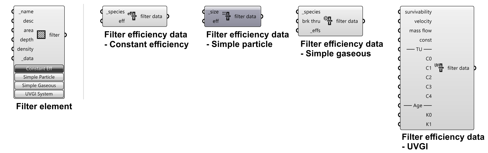
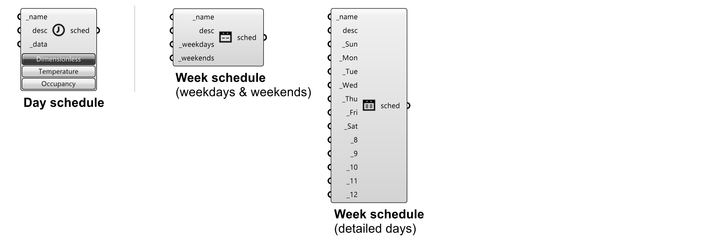
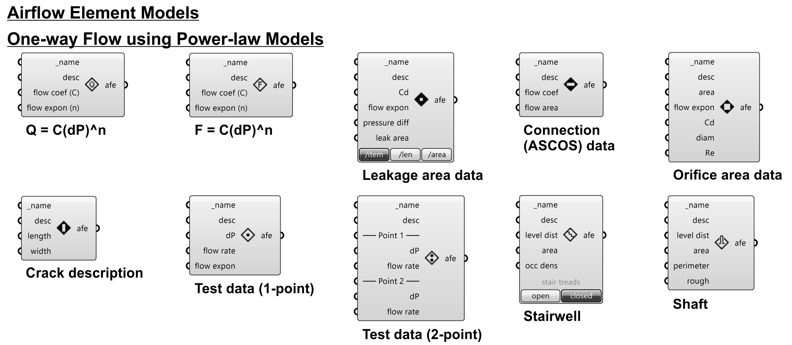
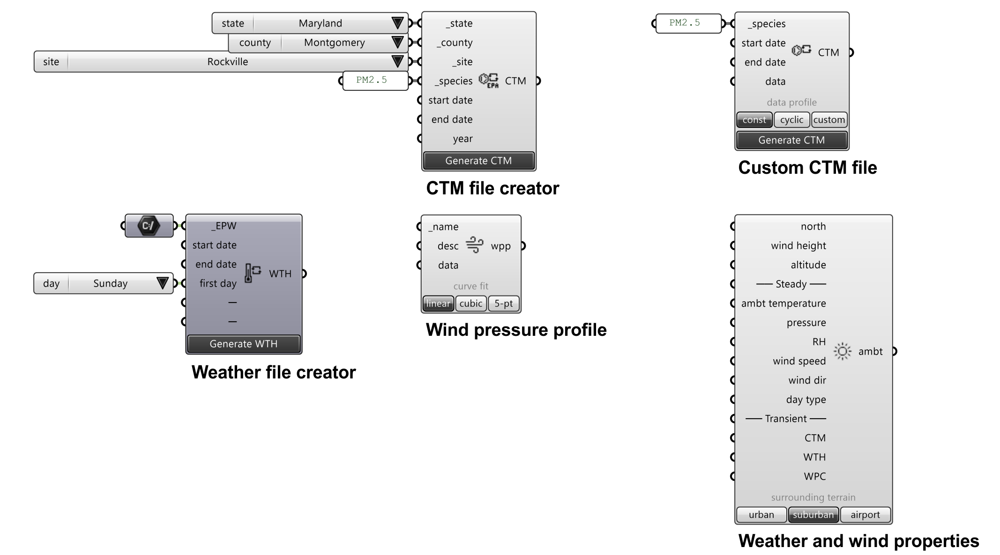

# Introduction to ANT components and CONTAM elements
## 01-Geometry

### Zone
Create zones
 - Inputs:
    - _zone [required]:
        - Type: Brep geometry - *List*
        - Default: None
        - Description: Zone geometry (brep) acquired from Rhino.
    - temperature: 
        - Type: Number / Week Schedule (temperature) - *List*
        - Default: 20 °C (constant)
        - Description: Zone temperature. 
            - A single input → Same input for all zones.
            - A list input → Specific input for each zone (must be a same size as zone inputs).
            - Number inputs → Constant number over time.
            - Schedule inputs → Variable temperatures over time.
    - init ctm conc: 
        - Type: Number - *List*
        - Default: A list of 0s
        - Description: Initial concentrations of simulated contaminants (specified in Project component) in the zone.
            - A list input → Specific concentration for each contaminant in all zones (must be a same size as contaminant inputs in Project component).
    - srcs/sinks: 
        - Type: Source/Sink - *List*
        - Default: None
        - Description: Source/Sink elements in the zone(s). Same list of sources/sinks is defined in all zones.
    - ahs sup/ret: 
        - Type: AHS Supply/AHS Return - *List*
        - Default: None
        - Description: Air handling system (AHS) supply/return elements in the zone(s). Same list of AHS supply/return is defined in all zones.

- Outputs:
    - zones:
        - Type: Zone - *List*
        - Description: CONTAM Zone elements.
### Door
Create doors
- Inputs:
    - _openings [required]:
        - Type: Brep/surface geometry - *List*
        - Default: None
        - Description: Door geometry (brep/surface) acquired from Rhino.
    - wpp:door:
        - Type: Wind pressure profile - *List*
        - Default: None
        - Description: Door wind pressure profile (WPP).
    - ucut area:
        - Type: Number - *List*
        - Default: 0.1 m²
        - Description: Door undercut area.
    - wpp:ucut:
        - Type: Wind pressure profile - *List*
        - Default: None
        - Description: Door undercut wind pressure profile (WPP).
    - sched:
        - Type: Week schedule - *List*
        - Default: None
        - Description: Door opening schedule.
- Outputs:
    - openings:
        - Type: Brep/surface geometry - *List*
        - Description: Door geometry (brep/surface) with defined settings.
        

### Window
### Orifice
### Generic opening

## 02-HVAC

### Air handing system (AHS)
### AHS Supply
### AHS Return
## 03-Filter

### Filter element
### Filter efficiency data - Constant efficiency
### Filter efficiency data - Simple gaseous
### Filter efficiency data - Simple particle
### Filter efficiency data - UVGI

## 04-Schedule

## 05-Species

## 06-Source/Sink

## 07-Occupancy

## 08-Airflow

## 09-Library

## 10-Ambient

## 11-Simulation

## 12-Results
