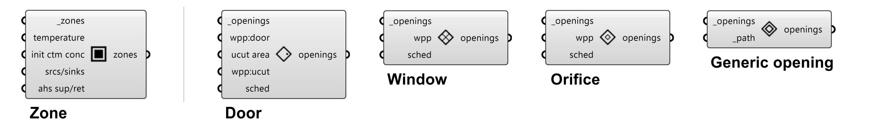
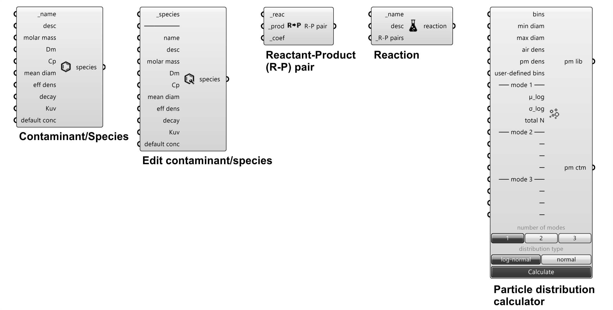
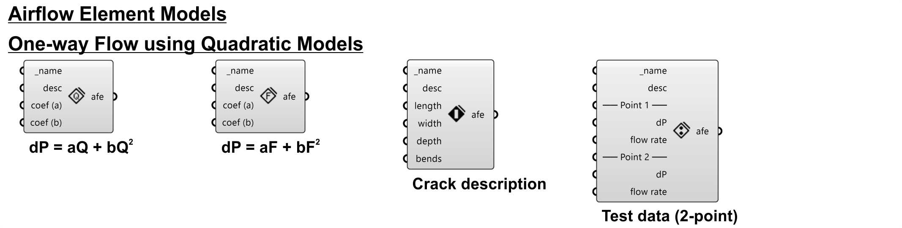
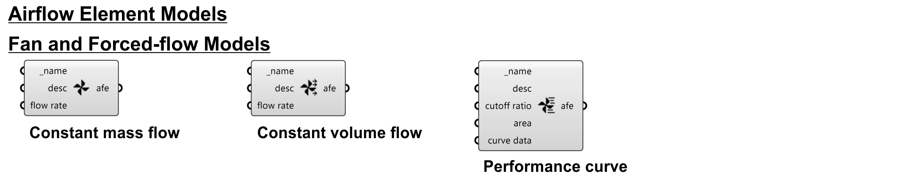
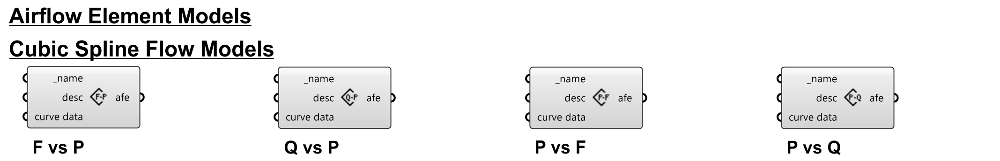

# Introduction to ANT components and CONTAM elements

ANT conponents are organized into 12 categories, each of which is represented by a tab in the ANT toolbar. The 12 categories are:
 - [01-Geometry](##01-Geometry)
    - [Zone](###zone)
    - [Door](###door)
    - [Window](###window)
    - [Orifice](###orifice)
    - [Generic opening](###generic-opening)
 - [02-HVAC](##02-HVAC)
 - [03-Filter](##03-Filter)
 - [04-Schedule](##04-Schedule)
 - [05-Species](##05-Species)
 - [06-Source/Sink](##06-Source/Sink)
 - [07-Occupancy](##07-Occupancy)
 - [08-Airflow](##08-Airflow)
 - [09-Library](##09-Library)
 - [10-Ambient](##10-Ambient)
 - [11-Simulation](##11-Simulation)
 - [12-Results](##12-Results)
 
CONTAM elements are essential for creating CONTAM projects and are associated with ANT components and created by ANT components. The details of CONTAM elements can be found in CONTAM associated documents (e.g., [CONTAM User Guide](https://www.nist.gov/publications/contam-user-guide-and-program-documentation-version-34)). Some elements are introduced here for better understanding of ANT components.

## 01-Geometry

### Zone
Create zones.
 - **Inputs**:
    - **_zone** [required]:
        - Type: Brep geometry [List]
        - Default: None
        - Description: Zone geometry (brep) acquired from Rhino.
    - **temperature**: 
        - Type: Number / Week Schedule (temperature) [Item]
        - Default: 20 °C (constant)
        - Description: Zone temperature. Same input for all specified zones (in **_zone**).
            - Number input → Constant temperature over time.
            - Schedule input → Variable temperatures over time.
    - **init ctm conc**: 
        - Type: Number [List]
        - Default: A list of 0s
        - Description: Initial concentrations of simulated contaminants (specified in [Project](###project) component). Must match the size of contaminant inputs in [Project](###project) component. Same input for all specified zones (in **_zone**).
    - **srcs/sinks**: 
        - Type: Source/Sink [List]
        - Default: None
        - Description: Source/Sink elements. Same input for all specified zones (in **_zone**).
    - **ahs sup/ret**: 
        - Type: AHS Supply/AHS Return [List]
        - Default: None
        - Description: Air handling system (AHS) supply/return elements. Same input for all specified zones (in **_zone**).
- **Outputs**:
    - **zones**:
        - Type: Brep geometry - [List]
        - Description: Brep geometry with updated settings.

### Door
Create doors.\
Each door by default contains an airflow path for the door (*two opening model* in two-way opening models) and an airflow path for the undercut (*orifice model* in one-way flow using powerlaw models).
- **Inputs**:
    - **_openings** [required]:
        - Type: Brep/surface geometry [List]
        - Default: None
        - Description: Door geometry (brep/surface) acquired from Rhino.
    - **wpp\:door**:
        - Type: Wind pressure profile [Item]
        - Default: None
        - Description: Wind pressure profile (WPP) for doors. Same input for all specified doors (in **_openings**). WPP is available only on exterior surfaces.
    - **ucut area**:
        - Type: Number [Item]
        - Default: Door width × default undercut thickness (1 in or 25.4 mm)
        - Description: Door undercut area. Same input for all specified doors (in **_openings**). 
    - **wpp:ucut**:
        - Type: Wind pressure profile [Item]
        - Default: None
        - Description: Wind pressure profile (WPP) for door undercuts. Same input for all undercuts of specified doors (in **_openings**).
    - **sched**:
        - Type: Week schedule (dimensionless) [Item]
        - Default: None
        - Description: Week schedule that controls the airflow paths doors. Same input for all specified doors (in **_openings**). Only available for airflow paths of doors (not working on undercut airflow paths).
- **Outputs**:
    - **openings**:
        - Type: Brep/surface geometry [List]
        - Description: Door geometry (brep/surface) with updated settings.
        
### Window
Create windows.\
Each window by default contains an airflow path. If the window is an openable window (with input on **sched**), a *two opening model* in two-way opening models is applied to the window. If the window is a fixed window (without input on **sched**), an *one opening model* in two-way opening models is applied.
- **Inputs**:
    - **_openings** [required]:
        - Type: Brep/surface geometry [List]
        - Default: None
        - Description: Window geometry (brep/surface) acquired from Rhino.
    - **wpp**:
        - Type: Wind pressure profile [Item]
        - Default: None
        - Description: Wind pressure profile (WPP) for windows. Same input for all specified windows (in **_openings**). WPP is available only on exterior surfaces.
    - **sched**:
        - Type: Week schedule (dimensionless) [Item]
        - Default: None
        - Description: Week schedule that controls the airflow paths of windows. Same input for all specified windows (in **_openings**). Only available for airflow paths of openable windows (not working on fixed windows).
- **Outputs**:
    - **openings**:
        - Type: Brep/surface geometry [List]
        - Description: Window geometry (brep/surface) with updated settings.
### Orifice
### Generic opening

## 02-HVAC

### Air handing system (AHS)
### AHS Supply
### AHS Return
## 03-Filter

### Filter element
### Filter efficiency data - Constant efficiency
### Filter efficiency data - Simple gaseous
### Filter efficiency data - Simple particle
### Filter efficiency data - UVGI

## 04-Schedule

## 05-Species

## 06-Source/Sink

## 07-Occupancy

## 08-Airflow

## 09-Library

## 10-Ambient

## 11-Simulation

### Project
### Simulation parameters
### Simulation
### Help
## 12-Results
