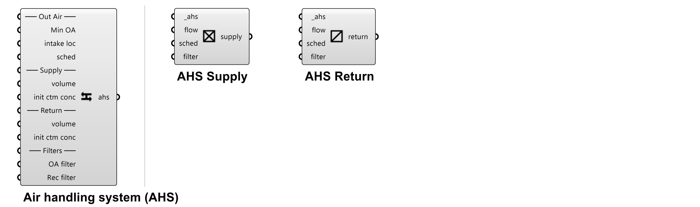
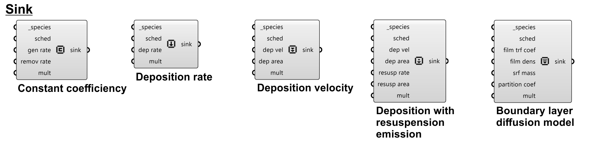
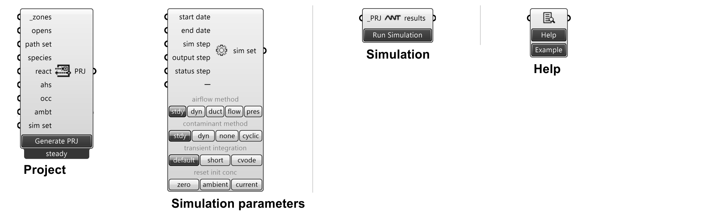

# Introduction to ANT components and CONTAM elements

ANT conponents are organized into 12 categories, each of which is represented by a tab in the ANT toolbar. The 12 categories are:
<!--ts-->
 - [01-Geometry](#01-geometry)
    - [Zone](#zone)
    - [Door](#door)
    - [Window](#window)
    - [Orifice](#orifice)
    - [Generic opening](#generic-opening)
 - [02-HVAC](#02-hvac)
    - [Air handling system (AHS)](#air-handing-system-ahs)
    - [AHS Supply](#ahs-supply)
    - [AHS Return](#ahs-return)
 - [03-Filter](#03-filter)
    - [Filter element](#filter-element)
    - [Filter efficiency data - Constant efficiency](#filter-efficiency-data---constant-efficiency)
    - [Filter efficiency data - Simple gaseous](#filter-efficiency-data---simple-gaseous)
    - [Filter efficiency data - Simple particle](#filter-efficiency-data---simple-particle)
    - [Filter efficiency data - UVGI](#filter-efficiency-data---uvgi)
 - [04-Schedule](#04-schedule)
    - [Day schedule](#day-schedule)
    - [Week schedule (weekdays & weekends)](#week-schedule-weekdays--weekends)
    - [Week schedule (detailed days)](#week-schedule-detailed-days)
 - [05-Species](#05-species)
    - [Contaminant/Species](#contaminantspecies)
    - [Edit contaminant/species](#edit-contaminantspecies)
    - [Reactant-Product (R-P) pair](#reactant-product-r-p-pair)
    - [Reaction](#reaction)
    - [Particle distribution calculator](#particle-distribution-calculator)
 - [06-Source/Sink](#06-sourcesink)
    - [Source - Constant coefficiency](#source---constant-coefficiency)
    - [Source - Burst mass](#source---burst-mass)
    - [Source - Cutoff concentration](#source---cutoff-concentration)
    - [Source - Decaying source](#source---decaying-source)
    - [Source - Pressure driven](#source---pressure-driven)
    - [Source - Peak model (NRCC)](#source---peak-model-nrcc)
    - [Source - Power-law model (NRCC)](#source---power-law-model-nrcc)
    - [Sink - Constant coefficiency](#sink---constant-coefficiency)
    - [Sink - Deposition rate](#sink---deposition-rate)
    - [Sink - Deposition velocity](#sink---deposition-velocity)
    - [Sink - Deposition with resuspension emission](#sink---deposition-with-resuspension-emission)
    - [Sink - Boundary layer diffusion model](#sink---boundary-layer-diffusion-model)
 - [07-Occupancy](#07-occupancy)
    - [Occupant](#occupant)
    - [Occupant contaminant generation](#occupant-contaminant-generation)
    - [Occupancy DALY factor library](#occupancy-daly-factor-library)
    - [Occupancy DALY factors](#occupancy-daly-factors)
    - [Occupancy exposure](#occupancy-exposure)
 - [08-Airflow](#08-airflow)
    - [Airflow path](#airflow-path)
    - [Airflow path settings](#airflow-path-settings)
    - [Airflow element - Q = C(dP)^n (One-way flow using power-law models)](#airflow-element---q--cdpn-one-way-flow-using-power-law-models)
    - [Airflow element - F = C(dP)^n (One-way flow using power-law models)](#airflow-element---f--cdpn-one-way-flow-using-power-law-models)
    - [Airflow element - Leakage area data (One-way flow using power-law models)](#airflow-element---leakage-area-data-one-way-flow-using-power-law-models)
    - [Airflow element - Connection (ASCOS) data (One-way flow using power-law models)](#airflow-element---connection-ascos-data-one-way-flow-using-power-law-models)
    - [Airflow element - Orifice area data (One-way flow using power-law models)](#airflow-element---orifice-area-data-one-way-flow-using-power-law-models)
    - [Airflow element - Crack description (One-way flow using power-law models)](#airflow-element---crack-description-one-way-flow-using-power-law-models)
    - [Airflow element - 1-point test data (One-way flow using power-law models)](#airflow-element---1-point-test-data-one-way-flow-using-power-law-models)
    - [Airflow element - 2-point test data (One-way flow using power-law models)](#airflow-element---2-point-test-data-one-way-flow-using-power-law-models)
    - [Airflow element - Stairwell (One-way flow using power-law models)](#airflow-element---stairwell-one-way-flow-using-power-law-models)
    - [Airflow element - Shaft (One-way flow using power-law models)](#airflow-element---shaft-one-way-flow-using-power-law-models)
    - [Airflow element - dP = aQ + bQ² (One-way flow using quadratic models)](#airflow-element---dp--aq--bq²-one-way-flow-using-quadratic-models)
    - [Airflow element - dP = aF + bF² (One-way flow using quadratic models)](#airflow-element---dp--af--bf²-one-way-flow-using-quadratic-models)
    - [Airflow element - Crack description (One-way flow using quadratic models)](#airflow-element---crack-description-one-way-flow-using-quadratic-models)
    - [Airflow element - 2-point test data (One-way flow using quadratic models)](#airflow-element---2-point-test-data-one-way-flow-using-quadratic-models)
    - [Airflow element - One-opening (Two-way flow models)](#airflow-element---one-opening-two-way-flow-models)
    - [Airflow element - Two-opening (Two-way flow models)](#airflow-element---two-opening-two-way-flow-models)
    - [Airflow element - Q = C(dP)^n (Backdraft damper flow models)](#airflow-element---q--cdpn-backdraft-damper-flow-models)
    - [Airflow element - F = C(dP)^n (Backdraft damper flow models)](#airflow-element---f--cdpn-backdraft-damper-flow-models)
    - [Airflow element - Self-regulating vent (Backdraft damper flow models)](#airflow-element---self-regulating-vent-backdraft-damper-flow-models)
    - [Airflow element - Constant mass flow (Fan and forced-flow models)](#airflow-element---constant-mass-flow-fan-and-forced-flow-models)
    - [Airflow element - Constant volume flow (Fan and forced-flow models)](#airflow-element---constant-volume-flow-fan-and-forced-flow-models)
    - [Airflow element - Performance curve (Fan and forced-flow models)](#airflow-element---performance-curve-fan-and-forced-flow-models)
    - [Airflow element - F vs P (Cubic spline flow models)](#airflow-element---f-vs-p-cubic-spline-flow-models)
    - [Airflow element - Q vs P (Cubic spline flow models)](#airflow-element---q-vs-p-cubic-spline-flow-models)
    - [Airflow element - P vs F (Cubic spline flow models)](#airflow-element---p-vs-f-cubic-spline-flow-models)
    - [Airflow element - P vs Q (Cubic spline flow models)](#airflow-element---p-vs-q-cubic-spline-flow-models)
 - [09-Library](#09-library)
    - [Library manager](#library-manager)
    - [Library](#library)
    - [External library](#external-library)
 - [10-Ambient](#10-ambient)
    - [CTM file creator](#ctm-file-creator)
    - [Custom CTM file](#custom-ctm-file)
    - [Weather file creator](#weather-file-creator)
    - [Wind pressure profile](#wind-pressure-profile)
    - [Weather and wind properties](#weather-and-wind-properties)
 - [11-Simulation](#11-simulation)
    - [Project](#project)
    - [Simulation parameters](#simulation-parameters)
    - [Simulation](#simulation)
    - [Help](#help)
 - [12-Results](#12-results)
    - [Results](#results)
    - [Contour](#contour)
    - [Legend](#legend)
    - [Plot](#plot)
    - [Moments](#moments)
    - [Loop](#loop)
<!--te-->
CONTAM elements are essential for creating CONTAM projects (PRJ) and are associated with ANT components and created by ANT components. Detailed introductions of CONTAM elements can be found in [CONTAM User Guide](https://www.nist.gov/publications/contam-user-guide-and-program-documentation-version-34). Some elements are introduced here for better understanding of ANT components.

## 01-Geometry

### Zone
Create zones.\
Zones with default names of `_zone_?` are created, where `?` is the number of zone created.
 - **Inputs**:
    - **_zone** [required]:
        - Type: Brep geometry [List]
        - Default: None
        - Description: Zone geometry (brep) acquired from Rhino.
    - **temperature**: 
        - Type: Number / Week Schedule (temperature) [Item]
        - Default: 20 °C (constant)
        - Description: Zone temperature. Same input for all specified zones (in **_zone**). Unit can be changed by right-clicking the component and selecting the desired one.
            - Number input: Constant temperature over time.
            - Schedule input: Variable temperatures over time.
    - **init ctm conc**: 
        - Type: Number [List]
        - Default: 0 for all contaminants
        - Description: Initial concentrations of simulated contaminants (specified in [Project](#project) component). Must match the size of contaminant inputs in [Project](#project) component. Same input for all specified zones (in **_zone**). Unit of each contaminant concentration is specified by users in [Contaminant/Species](#contaminantspecies) component, [Edit contaminant/species](#edit-contaminantspecies) component, or [Library](#library) component.
    - **srcs/sinks**: 
        - Type: Source/Sink [List]
        - Default: None
        - Description: Source/Sink elements. Same input for all specified zones (in **_zone**).
    - **ahs sup/ret**: 
        - Type: Airflow path (AHS supply/return) [List]
        - Default: None
        - Description: Airflow paths of air handling system (AHS) supply/return elements that work in the zones. Same input for all specified zones (in **_zone**).
- **Outputs**:
    - **zones**:
        - Type: Brep geometry - [List]
        - Description: Brep geometry with updated settings.

### Door
Create doors.\
Each door by default contains an airflow path for the door (*two opening model* in two-way opening models) and an airflow path for the undercut (*orifice model* in one-way flow using powerlaw models).
- **Inputs**:
    - **_openings** [required]:
        - Type: Brep/surface geometry [List]
        - Default: None
        - Description: Door geometry (brep/surface) acquired from Rhino.
    - **wpp\:door**:
        - Type: Wind pressure profile [Item]
        - Default: None
        - Description: Wind pressure profile (WPP) for doors. Same input for all specified doors (in **_openings**). WPP is available only on exterior surfaces.
    - **ucut area**:
        - Type: Number [Item]
        - Default: Door width × default undercut thickness (1 in or 25.4 mm)
        - Description: Door undercut area. Same input for all specified doors (in **_openings**). 
    - **wpp:ucut**:
        - Type: Wind pressure profile [Item]
        - Default: None
        - Description: Wind pressure profile (WPP) for door undercuts. Same input for all undercuts of specified doors (in **_openings**).
    - **sched**:
        - Type: Week schedule (dimensionless) [Item]
        - Default: None
        - Description: Week schedule that controls the airflow paths doors. Same input for all specified doors (in **_openings**). Only available for airflow paths of doors (not working on undercut airflow paths).
- **Outputs**:
    - **openings**:
        - Type: Brep/surface geometry [List]
        - Description: Door geometry (brep/surface) with updated settings.
        
### Window
Create windows.\
Each window by default contains an airflow path. If the window is an openable window (with input on **sched**), a *two opening model* in two-way opening models is applied to the window. If the window is a fixed window (without input on **sched**), an *one opening model* in two-way opening models is applied.
- **Inputs**:
    - **_openings** [required]:
        - Type: Brep/surface geometry [List]
        - Default: None
        - Description: Window geometry (brep/surface) acquired from Rhino.
    - **wpp**:
        - Type: Wind pressure profile [Item]
        - Default: None
        - Description: Wind pressure profile (WPP) for windows. Same input for all specified windows (in **_openings**). WPP is available only on exterior surfaces.
    - **sched**:
        - Type: Week schedule (dimensionless) [Item]
        - Default: None
        - Description: Week schedule that controls the airflow paths of windows. Same input for all specified windows (in **_openings**). Only available for airflow paths of openable windows (not working on fixed windows).
- **Outputs**:
    - **openings**:
        - Type: Brep/surface geometry [List]
        - Description: Window geometry (brep/surface) with updated settings.

### Orifice
Create orifices.\
Each orifice by default contains an airflow path of the orifice (*orifice model* in one-way flow using powerlaw models).
- **Inputs**:
    - **_openings** [required]:
        - Type: Brep/surface geometry [List]
        - Default: None
        - Description: Orifice geometry (brep/surface) acquired from Rhino.
    - **wpp**:
        - Type: Wind pressure profile [Item]
        - Default: None
        - Description: Wind pressure profile (WPP) for orifices. Same input for all specified orifices (in **_openings**). WPP is available only on exterior surfaces.
    - **sched**:
        - Type: Week schedule (dimensionless) [Item]
        - Default: None
        - Description: Week schedule that controls the airflow paths of orifices. Same input for all specified orifices (in **_openings**).
- **Outputs**:
    - **openings**:
        - Type: Brep/surface geometry [List]
        - Description: Orifice geometry (brep/surface) with updated settings.

### Generic opening
Create generic openings.\
Each generic opening contains an airflow path defined in **_path**. For openings with *fan and forced-flow models*, airflow direction is visualized and can be changed by right-clicking the component and reverse the flow direction.
- **Inputs**:
    - **_openings** [required]:
        - Type: Brep/surface/point geometry [List]
        - Default: None
        - Description: Generic opening geometry (brep/surface/point) acquired from Rhino.
    - **_path** [required]:
        - Type: Airflow path [Item]
        - Default: None
        - Description: Airflow path of generic openings. Same input for all specified generic openings (in **_openings**).
- **Outputs**:
    - **openings**:
        - Type: Brep/surface/point geometry [List]
        - Description: Generic opening geometry (brep/surface/point) with updated settings.

## 02-HVAC

### Air handing system (AHS)
Create air handling system (AHS).\
A simple AHS with a default name of `_ahs_?` is created, where `?` is the number of AHS created (AHS components that created).
- **Inputs**:\
    ── Out Air ──
    - **min OA**:
        - Type: Number [Item]
        - Default: 0
        - Description: Minimum outdoor air introduced to the AHS supply flow (mass flow rate). Unit can be changed by right-clicking the component and selecting the desired one.
    - **intake loc**:
        - Type: Number [List]
        - Default: 0, 0, 0
        - Description: Outdoor air intake location. Must be a list of 3 numbers, i.e., X, Y, Z coordinates, respectively. Required only when using a WPC file.
    - **sched**:
        - Type: Week schedule (dimensionless) [Item]
        - Default: None
        - Description: Week schedule that controls the outdoor air intake.

    ── Supply ──
    - **volume**:
        - Type: Number [Item]
        - Default: 0
        - Description: Volume of the supply sub-system (implicit return zone) of the simple AHS (e.g., supply-side duct work etc.). This volume is similar to a zone volume and will be used in the simulation of contaminant transport.
    - **init ctm conc**: 
        - Type: Number [List]
        - Default: 0 for all contaminants
        - Description: Initial concentrations of simulated contaminants (specified in [Project](#project) component) for the supply sub-system of the simple AHS. Must match the size of contaminant inputs in [Project](#project) component.
    
    ── Return ──
    - **volume**:
        - Type: Number [Item]
        - Default: 0
        - Description: Volume of the return sub-system (implicit return zone) of the simple AHS (e.g., return-side duct work etc.). This volume is similar to a zone volume and will be used in the simulation of contaminant transport.
    - **init ctm conc**: 
        - Type: Number [List]
        - Default: 0 for all contaminants
        - Description: Initial concentrations of simulated contaminants (specified in [Project](#project) component) for the return sub-system of the simple AHS. Must match the size of contaminant inputs in [Project](#project) component.
    
    ── Filters ──
    - **OA filter**:
        - Type: Filter element [Item]
        - Default: None
        - Description: Outdoor air filter element which affects the air brought in by the simple AHS from outside the building.
    - **Rec filter**:
        - Type: Filter element [Item]
        - Default: None
        - Description: Recirculation air filter element which affects the return air being circulated back through the simple AHS.
- **Outputs**:
    - **ahs**:
        - Type: Air handling system [Item]
        - Description: Air handling system (AHS) with updated settings.

### AHS Supply
Create AHS supply.
- **Inputs**:
    - **_ahs** [required]:
        - Type: Air handling system [Item]
        - Default: None
        - Description: AHS to which the supply is connected.
    - **flow**:
        - Type: Airflow path [Item]
        - Default: 0
        - Description: Design flow rate of supply air (mass flow rate). Unit can be changed by right-clicking the component and selecting the desired one.
    - **sched**: 
        - Type: Week schedule (dimensionless) [Item]
        - Default: None
        - Description: Week schedule that controls the supply air.
    - **filter**:
        - Type: Filter element [Item]
        - Default: None
        - Description: Filter element that affects the supply air.
- **Outputs**:
    - **supply**:
        - Type: Airflow path (AHS supply) [Item]
        - Description: Airflow path of AHS supply element with updated settings.

### AHS Return
Create AHS return.
- **Inputs**:
    - **_ahs** [required]:
        - Type: Air handling system [Item]
        - Default: None
        - Description: AHS to which the return is connected.
    - **flow**:
        - Type: Airflow path [Item]
        - Default: 0
        - Description: Design flow rate of return air (mass flow rate). Unit can be changed by right-clicking the component and selecting the desired one.
    - **sched**: 
        - Type: Week schedule (dimensionless) [Item]
        - Default: None
        - Description: Week schedule that controls the return air.
    - **filter**:
        - Type: Filter element [Item]
        - Default: None
        - Description: Filter element that affects the return air.
- **Outputs**:
    - **return**:
        - Type: Airflow path (AHS return) [Item]
        - Description: Airflow path of AHS return element with updated settings.

## 03-Filter

### Filter element
Create filter element.\
Four types of filter elements are available: constant efficiency, simple gaseous, simple particle, and ultraviolet germicidal irradiation (UVGI). The type of filter element can be selected by clicking the option buttons on the component.
 - **Inputs**:
    - **_name** [required]:
        - Type: Text [Item]
        - Default: None
        - Description: A unique name used to identify the filter element.
    - **desc**:
        - Type: Text [Item]
        - Default: None
        - Description: Detailed description of the filter element.
    - **area**:
        - Type: Number [Item]
        - Default: 1 m²
        - Description: Face area of the filter element.
    - **depth**:
        - Type: Number [Item]
        - Default: 0.1 m
        - Description: Depth of the filter element along the axis of airflow.
    - **density**:
        - Type: Number [Item]
        - Default: 100 kg/m³
        - Description: Density of the filter element. Unit can be changed by right-clicking the component and selecting the desired one.
    - **_data** [required]:
        - Type: Filter efficiency data [List]
        - Default: None
        - Description: A list of filter efficiency data that defines the contaminant removel efficiency by this filter element. Must match the type of filter element.
- **Outputs**:
    - **filter**:
        - Type: Filter element [Item]
        - Description: Filter element with updated settings.

### Filter efficiency data - Constant efficiency
Create filter efficiency data for constant efficiency filter element.
- **Inputs**:
    - **_species** [required]:
        - Type: Species [Item]
        - Default: None
        - Description: The contaminant species that is filtered by the filter element.
    - **eff**:
        - Type: Number [Item]
        - Default: 0
        - Description: The efficiency of the filter element to filter the given contaminant species. Value must be between 0 and 1.
- **Outputs**: 
    - **filter data**:
        - Type: Filter efficiency data (constant efficiency) [Item]
        - Description: Filter efficiency data for constant efficiency filter element with updated settings.

### Filter efficiency data - Simple gaseous
Create filter efficiency data for simple gaseous filter element.
- **Inputs**:
    - **_species** [required]:
        - Type: Species [Item]
        - Default: None
        - Description: The contaminant species that is filtered by the filter element.
    - **brk thru**: 
        - Type: Number [Item]
        - Default: 0
        - Description: The breakthrough concentration of the contaminant species for the simple gaseous filter element. This value will be used during simulation to report if and when the filter efficiency drops below this value. 
    - **_effs** [required]:
        - Type: Text [List]
        - Default: None
        - Description: A list of texts that represents the loading-efficiency pairs of the filter element. The loading-efficiency pair defines the efficiency of the filter element at the given loading. Each pair must be presented as a text in the format of `loading efficiency`. Loading and efficiency can be separated by a space` `, a comma`,`, a tab`    `, a colon`:`, or a dashline`-`. For example, `0.1 0.9`, `0.1,0.9`, and `0.1:0.9` are all valid loading-efficiency pairs.
- **Outputs**:
    - **filter data**:
        - Type: Filter efficiency data (simple gaseous) [Item]
        - Description: Filter efficiency data for simple gaseous filter element with updated settings.

### Filter efficiency data - Simple particle
Create filter efficiency data for simple particle filter element.
- **Inputs**:
    - **_size_** [required]:
        - Type: Number [Item]
        - Default: None
        - Description: The size of the particle, i.e. mean diameter, that is filtered by the filter element. Unit is in micrometer (μm).
    - **eff**:
        - Type: Number [Item]
        - Default: 0
        - Description: The efficiency of the filter element to filter particles of the given particle size. Value must be between 0 and 1.
- **Outputs**:
    - **filter data**:
        - Type: Filter efficiency data (simple particle) [Item]
        - Description: Filter efficiency data for simple particle filter element with updated settings.
### Filter efficiency data - UVGI
Create filter efficiency data for ultraviolet germicidal irradiation (UVGI) filter element.
- **Inputs**:
    - **survivability**:
        - Type: Number [Item]
        - Default: 0.01
        - Description: Desired survivability of the filter. Value must be between 0 and 1. The single-pass filter inactivation efficiency is equal to: 1 - survivability.
    - **velocity**:
        - Type: Number [Item]
        - Default: 4 m/s
        - Description: Design maximum Velocity expected through the filter flow region. Unit can be changed by right-clicking the component and selecting the desired one.
    - **mass flow**:
        - Type: Number [Item]
        - Default: 0.5 kg/s
        - Description: Design maximum airflow rate expected through the filter flow region (mass flow rate). Unit can be changed by right-clicking the component and selecting the desired one. This will be used along with the **velocity** to calculate the cross-sectional flow area. 
    - **const**:
        - Type: Number [Item]
        - Default: 0.02172
        - Description: Design minimum microorganism-specific rate constant. Unit is in m²/J. This will be used to determine the design UV dose.

    ─── TU ───
    - **C0**:
        - Type: Number [Item]
        - Default: 5.79
        - Description: TU constant C0. Used to determine the output as a percentage of design based on current conditions including flow velocity and temperature. 
    - **C1**:
        - Type: Number [Item]
        - Default: 5.66
        - Description: TU constant C1. Used to determine the output as a percentage of design based on current conditions including flow velocity and temperature. 
    - **C2**:
        - Type: Number [Item]
        - Default: -20.3
        - Description: TU constant C2. Used to determine the output as a percentage of design based on current conditions including flow velocity and temperature. 
    - **C3**:
        - Type: Number [Item]
        - Default: -0.0701
        - Description: TU constant C3. Used to determine the output as a percentage of design based on current conditions including flow velocity and temperature. 
    - **C4**:
        - Type: Number [Item]
        - Default: 4.01
        - Description: TU constant C4. Used to determine the output as a percentage of design based on current conditions including flow velocity and temperature. 

    ─── Age ───
    - **K0**:
        - Type: Number [Item]
        - Default: 0
        - Description: Age constant K0. Used to determine the percentage of output based on the lamp age function. 
    - **K1**:
        - Type: Number [Item]
        - Default: 0
        - Description: Age constant K1. Used to determine the percentage of output based on the lamp age function. 
- **Outputs**:
    - **filter data**:
        - Type: Filter efficiency data (UVGI) [Item]
        - Description: Filter efficiency data for UVGI filter element with updated settings.

## 04-Schedule

### Day schedule
Create a day schedule.\
Three types of day schedules are available: dimensionless, temperature, and occupancy. The type of day schedule can be selected by clicking the option buttons on the component. The interpretion shape of the data can be changed by right-clicking the component and selecting the desired one (rectangular or trapezoidal).
- **Inputs**:
    - **_name_** [required]:
        - Type: Text [Item]
        - Default: None
        - Description: A unique name used to identify the day schedule.
    - **desc**:
        - Type: Text [Item]
        - Default: None
        - Description: Detailed description of the day schedule.
    - **_data** [required]:
        - Type: Text [List]
        - Default: None
        - Description: A list of texts that represents the day schedule data. Each text must be presented as a text in the format of `time value`. Time and value can be separated by a space` `, a comma`,`, a tab`    `, or a dashline`-`. For example, `0 0.1`, `0,0.1`, and `0-0.1` are all valid time-value pairs.
            - `time`: needs to be in the format of `H:mm:ss`, `H:mm`, or simply `H`. For example, `6`, `6:00`, and `6:00:00` are all valid time formats for 6AM. A valid day schedule must be started with time 0 (`0`, `0:00`, or `0:00:00`) and ended with time 24 (`24`, `24:00`, or `24:00:00`). 
            - `value`: 
                - Dimensionless day schedule: `value` needs to be a number between 0 and 1.
                - Temperature day schedule: `value` can be any number in °C or °F. Unit can be changed by right-clicking the component and selecting the desired one.
                - Occupancy day schedule: `value` needs to be a string of zone name. Zone names can be visualized by right-clicking the component and clicking the *visualize zone names* item. For example, `6, _zone_1` represents the occupant is in *_zone_1* at 6AM.
 - **Outputs**:
    - **day sched**:
        - Type: Day schedule [Item]
        - Description: A day schedule element with updated settings.

### Week schedule (weekdays & weekends)
Create a week schedule by defining the day schedules for weekdays and weekends.
 - **Inputs**:
    - **_name_** [required]:
        - Type: Text [Item]
        - Default: None
        - Description: A unique name used to identify the week schedule.
    - **desc**:
        - Type: Text [Item]
        - Default: None
        - Description: Detailed description of the week schedule.
    - **_weekdays** [required]:
        - Type: Day schedule [Item]
        - Default: None
        - Description: A day schedule element for all weekdays  (Monday through Friday).
    - **_weekends** [required]:
        - Type: Day schedule [Item]
        - Default: None
        - Description: A day schedule element for all weekends (Saturday and Sunday) and extra days (day type 8 - 12, defined for days with non-typical schedules, such as holidays).
 - **Outputs**: 
    - **sched**:
        - Type: Week schedule [Item]
        - Description: A week schedule element with updated settings.

### Week schedule (detailed days)
Create a week schedule by defining the day schedules for each day of the week and extra days.
 - **Inputs**:
    - **_name_** [required]:
        - Type: Text [Item]
        - Default: None
        - Description: A unique name used to identify the week schedule.
    - **desc**:
        - Type: Text [Item]
        - Default: None
        - Description: Detailed description of the week schedule.
    - **_Sun** [required]:
        - Type: Day schedule [Item]
        - Default: None
        - Description: A day schedule element for Sunday.
    - **_Mon** [required]:
        - Type: Day schedule [Item]
        - Default: None
        - Description: A day schedule element for Monday.
    - **_Tue** [required]:
        - Type: Day schedule [Item]
        - Default: None
        - Description: A day schedule element for Tuesday.
    - **_Wed** [required]:
        - Type: Day schedule [Item]
        - Default: None
        - Description: A day schedule element for Wednesday.
    - **_Thu** [required]:
        - Type: Day schedule [Item]
        - Default: None
        - Description: A day schedule element for Thursday.
    - **_Fri** [required]:
        - Type: Day schedule [Item]
        - Default: None
        - Description: A day schedule element for Friday.
    - **_Sat** [required]:
        - Type: Day schedule [Item]
        - Default: None
        - Description: A day schedule element for Saturday.
    - **_8** [required]:
        - Type: Day schedule [Item]
        - Default: None
        - Description: A day schedule element for day type 8.
    - **_9** [required]:
        - Type: Day schedule [Item]
        - Default: None
        - Description: A day schedule element for day type 9.
    - **_10** [required]:
        - Type: Day schedule [Item]
        - Default: None
        - Description: A day schedule element for day type 10.
    - **_11** [required]:
        - Type: Day schedule [Item]
        - Default: None
        - Description: A day schedule element for day type 11.
    - **_12** [required]:
        - Type: Day schedule [Item]
        - Default: None
        - Description: A day schedule element for day type 12.
- **Outputs**:
    - **sched**:
        - Type: Week schedule [Item]
        - Description: A week schedule element with updated settings.

## 05-Species

### Contaminant/Species
Create a contaminant/species element.\
Contaminant/species concentration unit can be changed by right-clicking the component and selecting the desired one. All contaminants/species are assumed to be trace contaminants/species by default.
 - **Inputs**:
    - **_name_** [required]:
        - Type: Text [Item]
        - Default: None
        - Description: A unique name used to identify the contaminant/species. Must NOT be the same as the species names defined in the system species library, including PM2.5, CO2, CO, NO2, Ozone, SO2, IV1. 
    - **desc**:
        - Type: Text [Item]
        - Default: None
        - Description: Detailed description of the contaminant/species.
    - **molar mass**:
        - Type: Number [Item]
        - Default: 0
        - Description: Molar mass of the contaminant/species in g/mol (kg/kmol).
    - **Dm**:
        - Type: Number [Item]
        - Default: 0.00002 m²/s
        - Description: Diffusion coefficient of the contaminant/species. Unit can be changed by right-clicking the component and selecting the desired one.
    - **Cp**:
        - Type: Number [Item]
        - Default: 1000 J/(kgK)
        - Description: Specific heat capacity of the contaminant/species. Unit can be changed by right-clicking the component and selecting the desired one. Only used when the *variable junction temperatures* method is selected (invalid in the current version of ANT).
    - **mean diam**:
        - Type: Number [Item]
        - Default: 0
        - Description: Mean diameter of the contaminant/species if this species is to be a particulate type species. Unit is micrometer (μm). Used when converting between particle count units and particle mass and volume units, and to determine filter efficiency of *simple particle filter elements* for this size particle.
    - **eff dens**:
        - Type: Number [Item]
        - Default: 0
        - Description: Effective density of the contaminant/species that is considered to be a particulate type species. Unit can be changed by right-clicking the component and selecting the desired one. Only used when converting between particle count units and particle mass and volume units.
    - **decay**: 
        - Type: Number [Item]
        - Default: 0
        - Description: Exponential decay constant based upon the half-life of the radioactive species. Unit is in 1/s.
    - **Kuv**:
        - Type: Number [Item]
        - Default: 0
        - Description: Species-dependent rate constant used to determine UVGI filter effectiveness for a specific contaminant. Unit is m²/J.
    - **default conc**:
        - Type: Number [Item]
        - Default: 0
        - Description: Default concentration of the contaminant/species. Unit can be changed by right-clicking the component and selecting the desired one. This value will be applied as the default initial concentration for each zone. Initial concentration for individual zones can be revised in [Zone](#zone) component per requirements. This value will also be used as the ambient contaminant concentration during simulations when no external ambient contaminant data file (CTM or WPC) is provided.
 - **Outputs**:
    - **species**:
        - Type: Species [Item]
        - Description: A contaminant/species element with updated settings.

### Edit contaminant/species
Edit existing contaminant/species.
Contaminant/species settings will show up when the component is connected to an existing contaminant/species.
 - **Inputs**:
    - **_species** [required]:
        - Type: Species [Item]
        - Default: None
        - Description: A contaminant/species element to be edited.
    - *species settings*: Same as the inputs of [Contaminant/Species](#contaminantspecies).
 - **Outputs**:
    - **species**:
        - Type: Species [Item]
        - Description: A contaminant/species element with updated settings.

### Reactant-Product (R-P) pair
Create a reactant-product (R-P) pair to create a kinetic reaction between two species.
 - **Inputs**:
    - **_reac** [required]:
        - Type: Species [Item]
        - Default: None
        - Description: The reactant contaminant/species element in the R-P pair.
    - **_prod** [required]:
        - Type: Species [Item]
        - Default: None
        - Description: The product contaminant/species element in the R-P pair.
    - **_coef** [required]:
        - Type: Number [Item]
        - Default: None
        - Description: The reaction coefficiency from the reactant to the product.
 - **Outputs**:
    - **R-P pair**:
        - Type: R-P pair [Item]
        - Description: A reactant-product (R-P) pair element with updated settings.

### Reaction
Create a kinetic reaction between contaminants/species.
 - **Inputs**: 
    - **_name** [required]:
        - Type: Text [Item]
        - Default: None
        - Description: A unique name used to identify the reaction.
    - **desc**:
        - Type: Text [Item]
        - Default: None
        - Description: Detailed description of the reaction.
    - **_R-P pairs** [required]:
        - Type: R-P pair [List]
        - Default: None
        - Description: A list of R-P pairs that define the reaction.
 - **Outputs**:
    - **reaction**:
        - Type: Reaction [Item]
        - Description: A kinetic reaction element with updated settings.

### Particle distribution calculator
Calculate particle distribution and generate a species library (LB0) of particles with desired distributions and a CTM file of particles.\
The original calculator is a web application on CONTAM website: [Particle Distribution Calculator](https://www.nist.gov/el/energy-and-environment-division-73200/nist-multizone-modeling/software/contam-particle). Number of modes can be selected by clicking the *number of modes* button on the component. Distribution type can be selected by clicking the *distribution type* button on the component. Click *Calculate* button on the component to generate desired files (LB0 and CTM). 
 - **Inputs**:
    - **bins**: 
        - Type: Integer [Item]
        - Default: 20
        - Description: Number of bins to divide the particle size range into.
    - **min diam**:
        - Type: Number [Item]
        - Default: 0.001 µm
        - Description: Smallest particle diameter. Unit is in micrometer (µm).
    - **max diam**:
        - Type: Number [Item]
        - Default: 10 µm
        - Description: Largest particle diameter. Unit is in micrometer (µm).
    - **air dens**:
        - Type: Number [Item]
        - Default: 1.2041 kg/m³
        - Description: Air density. Unit is in kg/m³.
    - **pm dens**:
        - Type: Number [Item]
        - Default: 1200 kg/m³
        - Description: Particle density. Unit is in kg/m³.
    - **user-defined bins**:
        - Type: Text [List]
        - Default: None
        - Description: A list of texts that represents the user-defined bins. If this input is not empty, the inputs of **bins**, **min diam**, **max diam**, and *mode settings* will be ignored. The size of list represents the number of bins. Each text must be presented as a text in the format of `diameter[µm]  concentration[#/cm³] (concentration[#/cm³] concentration[#/cm³])` (mode 1: `concentration[#/cm³]` × 1; mode 2: `concentration[#/cm³]` × 2; mode 3: `concentration[#/cm³]` × 3). Variables can be separated by a space` `, a comma`,`, a tab`    `, or a dashline`-`. For example, `0.1 100`, `0.1,100`, and `0.1-100` are all valid user-defined bins. The selection of *number of modes* needs to match the size of each text of user-defined bin (e.g., if mode = 3, the bin text should be `diameter, conc 1, conc 2, conc 3`). For example, `0.1, 100, 200, 300` represents the particle distribution has 3 modes, the concentration of particles in 0.1 µm diameter is 100 #/cm³, 200 #/cm³, and 300 #/cm³ for mode 1, 2, and 3, respectively. 
        
    ── mode 1 ──
    - **µ_log** (or **µ** for normal distribution):
        - Type: Number [Item]
        - Default: 0.014 µm
        - Description: Mean (µ) of particle diameters. Unit is in micrometer (µm).
    - **σ_log** (or **σ** for normal distribution):
        - Type: Number [Item]
        - Default: 1.8 µm
        - Description: Standard deviation (σ) of particle diameters. Unit is in micrometer (µm).
    - **total N**:
        - Type: Number [Item]
        - Default: 10600 #/cm³
        - Description: Total particle number concentration. Unit is in #/cm³.

    ── mode 2 ──
    - **µ_log** (or **µ** for normal distribution):
        - Type: Number [Item]
        - Default: 0.054 µm
        - Description: Mean (µ) of particle diameters. Unit is in micrometer (µm).
    - **σ_log** (or **σ** for normal distribution):
        - Type: Number [Item]
        - Default: 2.16 µm
        - Description: Standard deviation (σ) of particle diameters. Unit is in micrometer (µm).
    - **total N**:
        - Type: Number [Item]
        - Default: 32000 #/cm³
        - Description: Total particle number concentration. Unit is in #/cm³.

    ── mode 3 ──
    - **µ_log** (or **µ** for normal distribution):
        - Type: Number [Item]
        - Default: 0.86 µm
        - Description: Mean (µ) of particle diameters. Unit is in micrometer (µm).
    - **σ_log** (or **σ** for normal distribution):
        - Type: Number [Item]
        - Default: 2.21 µm
        - Description: Standard deviation (σ) of particle diameters. Unit is in micrometer (µm).
    - **total N**:
        - Type: Number [Item]
        - Default: 5.4 #/cm³
        - Description: Total particle number concentration. Unit is in #/cm³.
 - **Outputs**:
    - **pm LB0**:
        - Type: Text [Item]
        - Description: A relative file path of the generated species library file (LB0).
    - **pm CTM**:
        - Type: Text [Item]
        - Description: A relative file path of the generated CTM file of particles. It is notable that the species concentrations in the CTM file have been converted into the default mass fraction concentration ($kg_{\alpha}/kg_{air}$) by the component itself. No further conversion is needed.

## 06-Source/Sink

### Source - Constant coefficiency
Create a contaminant/species source with a constant generation/removal rate.\
A constant coefficiency source with a default name of `_SrcCsCcf_?` is created, where `?` is the number of constant coefficiency source created.\
The generation rate is calculated by:
$$S_\alpha(t) = mult \cdot ctrl \cdot G - mult \cdot ctrl \cdot R \cdot C_\alpha(t)$$
$S_\alpha(t)$ = Source strength at time $t$ [ $kg_\alpha /s$ ]\
$G$ = Generation rate [ $kg_\alpha /s$ ]\
$R$ = Effective removal rate [ $kg_{air} /s$ ]\
Determine by multiplying the first-order removal rate of the contaminant [ $1/s$ ] by air density [ $kg_{air}/m^3$ ] and volume [ $m^3$ ] of the zone in which the source is to be located.\
$C_\alpha(t)$ = Concentration of contaminant $\alpha$ in the zone at time $t$ [ $kg_\alpha / kg_{air}$ ]\
$mult$ = Source/sink multiplier [no units]\
$ctrl$ = Schedule or control value [no units] 

 - **Inputs**:
    - **_species** [required]:
        - Type: Species [Item]
        - Default: None
        - Description: A species element that is associated with the source.
    - **sched**:
        - Type: Week schedule (dimensionless) [Item]
        - Default: None
        - Description: Week schedule that controls the source.
    - **gen rate**:
        - Type: Number [Item]
        - Default: 0
        - Description: The rate at which the contaminant/species is introduced into the zone ($G$). Unit can be changed by right-clicking the component and selecting the desired one.
    - **remov rate**:
        - Type: Number [Item]
        - Default: 0
        - Description: The rate at which the contaminant/species is removed from the zone ($R$). Unit can be changed by right-clicking the component and selecting the desired one.
    - **mult**:
        - Type: Number [Item]
        - Default: 1
        - Description: Multiplier. A constant value by which the source strength will be multiplied during simulation. With this feature you could define a source/sink element having a source strength per unit area then use the multiplier as the area of the zone for each source/sink that uses the per unit area source/sink element.
 - **Outputs**:
    - **src**:
        - Type: Source [Item]
        - Description: A source element with updated settings.
        
### Source - Burst mass
Create a contaminant/species source, which releases instantaneous mass of contaminant into the zone.\
A burst mass source with a default name of `_SrcCsBrs_?` is created, where `?` is the number of burst mass source created.
 - **Inputs**:
    - **_species** [required]:
        - Type: Species [Item]
        - Default: None
        - Description: A species element that is associated with the source.
    - **sched**:
        - Type: Week schedule (dimensionless) [Item]
        - Default: None
        - Description: Week schedule that controls the source.
    - **mass added**:
        - Type: Number [Item]
        - Default: 0
        - Description: A value for the instantaneous mass release into the zone. The addition of mass is controlled by a schedule; when the schedule changes from zero to a non-zero value, mass is added to the zone in one simulation time setp. The amount of mass added is equal to the mass added to zone value times the schedule value. A single schedule can initiate several events at different times. Unit can be changed by right-clicking the component and selecting the desired one.
    - **mult**:
        - Type: Number [Item]
        - Default: 1
        - Description: Multiplier. A constant value by which the source strength will be multiplied during simulation. With this feature you could define a source/sink element having a source strength per unit area then use the multiplier as the area of the zone for each source/sink that uses the per unit area source/sink element.
 - **Outputs**:
    - **src**:
        - Type: Source [Item]
        - Description: A source element with updated settings.

### Source - Cutoff concentration
Create a contaminant/species source with a reducing emission as the concentration within the zone approaching a specified cutoff concentration.\
A cutoff concentration source with a default name of `_SrcCsCut_?` is created, where `?` is the number of cutoff concentration source created.\
This model may be appropriate for some sources of volatile organic compounds (VOCs).\
The generation rate is calculated by:
$$S_\alpha(t) = mult \cdot ctrl \cdot G \cdot (1 - C_\alpha(t)/C_{cut})$$
$S_\alpha(t)$ = Source strength at time $t$ [ $kg_\alpha /s$ ]\
$G$ = Generation rate [ $kg_\alpha /s$ ]\
$C_\alpha(t)$ = Concentration of contaminant $\alpha$ in the zone at time $t$ [ $kg_\alpha / kg_{air}$ ]\
$C_{cut}$ = Cutoff concentration at which emission ceases [ $kg_\alpha / kg_{air}$ ]\
$mult$ = Source/sink multiplier [no units]\
$ctrl$ = Schedule or control value [no units] 

 - **Inputs**:
    - **_species** [required]:
        - Type: Species [Item]
        - Default: None
        - Description: A species element that is associated with the source.
    - **sched**:
        - Type: Week schedule (dimensionless) [Item]
        - Default: None
        - Description: Week schedule that controls the source.
    - **gen rate**:
        - Type: Number [Item]
        - Default: 0
        - Description: The rate at which the contaminant/species is introduced into the zone as a function of concentration ($G$). Unit can be changed by right-clicking the component and selecting the desired one.
    - **cutoff conc**:
        - Type: Number [Item]
        - Default: 0
        - Description: The concentration at which the source emission is reduced to zero ($C_{cut}$). Unit can be changed by right-clicking the component and selecting the desired one.
    - **mult**:
        - Type: Number [Item]
        - Default: 1
        - Description: Multiplier. A constant value by which the source strength will be multiplied during simulation. With this feature you could define a source/sink element having a source strength per unit area then use the multiplier as the area of the zone for each source/sink that uses the per unit area source/sink element.

### Source - Decaying source
Create a contaminant/species source with exponentially decaying with time according to a user-defined time constant.\
A decaying source with a default name of `_SrcCsEds_?` is created, where `?` is the number of decaying source created.\
This model may be appropriate for some sources of volatile organic compounds (VOCs).\
The generation rate is calculated by:

$$S_\alpha(t) = mult \cdot ctrl \cdot G_0 \cdot e^{-\Delta t/\tau _c}$$

$S_\alpha(t)$ = Source strength at time $t$ [ $kg_\alpha /s$ ]\
$G_0$ = Initial generation rate [ $kg_\alpha /s$ ]\
$\Delta t$ = Elapsed time since the start of emission [ $s$ ]\
$\tau _c$ = Time constant [ $s$ ]\
$mult$ = Source/sink multiplier [no units]\
$ctrl$ = Schedule or control value [no units] 

 - **Inputs**:
    - **_species** [required]:
        - Type: Species [Item]
        - Default: None
        - Description: A species element that is associated with the source.
    - **sched**:
        - Type: Week schedule (dimensionless) [Item]
        - Default: None
        - Description: Week schedule that controls the source.
    - **gen rate**:
        - Type: Number [Item]
        - Default: 0
        - Description: Initial generation rate ($G_0$). Contaminant generation is controlled by a schedule. Contaminant generation begins when the schedule changes from a zero to a non-zero value (between 0 and 1). The initial generation is equal to the schedule value times the initial generation rate. A single scheudle may be used to initiate several emissions at different times. Unit can be changed by right-clicking the component and selecting the desired one.
    - **decay const**:
        - Type: Number [Item]
        - Default: 0
        - Description: The time at which the generation rate decays by 0.368 of the original rate ($\tau_c$). Unit can be changed by right-clicking the component and selecting the desired one.
    - **mult**:
        - Type: Number [Item]
        - Default: 1
        - Description: Multiplier. A constant value by which the source strength will be multiplied during simulation. With this feature you could define a source/sink element having a source strength per unit area then use the multiplier as the area of the zone for each source/sink that uses the per unit area source/sink element.
 - **Outputs**:
    - **src**:
        - Type: Source [Item]
        - Description: A source element with updated settings.

### Source - Pressure driven
Create a contaminant/species source that is governed by the pressure differences between interior and exterior zones, e.g., radon or soil gas entry.\
A pressure driven source with a default name of `_SrcCsPrs_?` is created, where `?` is the number of pressure driven source created.\
The generation rate is calculated by:
$$S_\alpha(t) = mult \cdot ctrl \cdot G (\Delta P)^n$$
$S_\alpha(t)$ = Source strength at time $t$ [ $kg_\alpha /s$ ]\
$G$ = Generation rate coefficient [ $kg_\alpha /Pa^n \cdot s$ ]\
$\Delta P$ = Pressure difference (ambient pressure - zone pressure) [ $Pa$ ]\
$n$ = Pressure exponent [no units]\
$mult$ = Source/sink multiplier [no units]\
$ctrl$ = Schedule or control value [no units] 
 - **Inputs**:
    - **_species** [required]:
        - Type: Species [Item]
        - Default: None
        - Description: A species element that is associated with the source.
    - **sched**:
        - Type: Week schedule (dimensionless) [Item]
        - Default: None
        - Description: Week schedule that controls the source.
    - **gen rate**:
        - Type: Number [Item]
        - Default: 0
        - Description: The rate at which the contaminant/species is introduced into the zone as a function of pressure difference ($G$). Unit can be changed by right-clicking the component and selecting the desired one.
    - **press expon**:
        - Type: Number [Item]
        - Default: 0
        - Description: Pressure exponent ($n$). It describe the dependence on pressure of the contaminant entry.
    - **mult**:
        - Type: Number [Item]
        - Default: 1
        - Description: Multiplier. A constant value by which the source strength will be multiplied during simulation. With this feature you could define a source/sink element having a source strength per unit area then use the multiplier as the area of the zone for each source/sink that uses the per unit area source/sink element.
 - **Outputs**:
    - **src**:
        - Type: Source [Item]
        - Description: A source element with updated settings.

### Source - Peak model (NRCC)
Create a contaminant/species source with a constant emission rate until specified time at which the peak emission rate is obtained after which time the emission rate decays according to the peak model relationship.\
A peak model source with a default name of `_SrcCsPkm_?` is created, where `?` is the number of peak model source created.\
This source is provided for compatibility with the Material Emissions Database developed by the National Research Council Canada (NRCC) that is largely based on material emission test chamber data.\
The generation rate is calculated by:
$$S_\alpha(t) = mult \cdot a \cdot e ^ {-0.5[(1/b) \cdot ln(t/t_p)]^2}$$
$S_\alpha(t)$ = Source strength at time $t$ [ $kg_\alpha /s$ ]. It will increase up until time $t_p$ at which point it will begin to decay.\
$a$, $b$, and $t_p$ = Empirical coefficients typically determined from emission chamber measurements.\
$mult$ = Source/sink multiplier [no units]

 - **Inputs**:
    - **_species** [required]:
        - Type: Species [Item]
        - Default: None
        - Description: A species element that is associated with the source.
    - **sched**:
        - Type: Week schedule (dimensionless) [Item]
        - Default: None
        - Description: Week schedule that controls the source.
    - **peak gen**:
        - Type: Number [Item]
        - Default: 0
        - Description: Peak emission rate ($a$). Unit can be changed by right-clicking the component and selecting the desired one.
    - **fit param**:
        - Type: Number [Item]
        - Default: 0
        - Description: The fitting parameter ($b$).
    - **time**:
        - Type: Number [Item]
        - Default: 0
        - Description: The time at which the peak emission rate is obtained ($t_p$). Unit can be changed by right-clicking the component and selecting the desired one.
    - **mult**:
        - Type: Number [Item]
        - Default: 1
        - Description: Multiplier. A constant value by which the source strength will be multiplied during simulation. With this feature you could define a source/sink element having a source strength per unit area then use the multiplier as the area of the zone for each source/sink that uses the per unit area source/sink element.
 - **Outputs**:
    - **src**:
        - Type: Source [Item]
        - Description: A source element with updated settings.

### Source - Power-law model (NRCC)
Create a contaminant/species source with a constant emission rate until specified time after which time the emission rate decays according to the power law relationship.\
A power-law model source with a default name of `_SrcCsPlm_?` is created, where `?` is the number of power-law model source created.\
This source is provided for compatibility with the Material Emissions Database developed by the National Research Council Canada (NRCC) that is largely based on material emission test chamber data.\
The generation rate is calculated by:\
For $t	\leqslant t_p$ the initial emission rate is:
$$S_{\alpha,o}(t) = mult \cdot a \cdot t_p^{-b}$$
and for $t > t_p$:
$$S_\alpha(t) = mult \cdot a \cdot t^{-b}$$
$S_{\alpha,o}(t)$ = Intitial source strength before time $t_p$ [ $kg_\alpha /s$ ].\
$S_\alpha(t)$ = Source strength at time $t$ [ $kg_\alpha /s$ ].\
$a$ and $b$ = Empirical coefficients typically determined from emission chamber measurements.\
$t_p$ = Power-law model time [ $s$ ].\
$mult$ = Source/sink multiplier [no units]

 - **Inputs**:
    - **_species** [required]:
        - Type: Species [Item]
        - Default: None
        - Description: A species element that is associated with the source.
    - **sched**:
        - Type: Week schedule (dimensionless) [Item]
        - Default: None
        - Description: Week schedule that controls the source.
    - **init gen**:
        - Type: Number [Item]
        - Default: 0
        - Description: Initial emission rate ($a$). Unit can be changed by right-clicking the component and selecting the desired one.
    - **expon**:
        - Type: Number [Item]
        - Default: 0
        - Description: The power law exponent ($b$).
    - **time**:
        - Type: Number [Item]
        - Default: 0
        - Description: Power-law model time ($t_p$). Unit can be changed by right-clicking the component and selecting the desired one.
    - **mult**:
        - Type: Number [Item]
        - Default: 1
        - Description: Multiplier. A constant value by which the source strength will be multiplied during simulation. With this feature you could define a source/sink element having a source strength per unit area then use the multiplier as the area of the zone for each source/sink that uses the per unit area source/sink element.
 - **Outputs**:
    - **src**:
        - Type: Source [Item]
        - Description: A source element with updated settings.

### Sink - Constant coefficiency
Create a contaminant/species sink with a constant generation/removal rate.\
A constant coefficiency sink with a default name of `_SinkCsCcf_?` is created, where `?` is the number of constant coefficiency sink created.\
The removal rate is calculated by:
$$R_\alpha(t) = mult \cdot ctrl \cdot G - mult \cdot ctrl \cdot R \cdot C_\alpha(t)$$
$R_\alpha(t)$ = Sink strength at time $t$ [ $kg_\alpha /s$ ]\
$G$ = Generation rate [ $kg_\alpha /s$ ]\
$R$ = Effective removal rate [ $kg_{air} /s$ ]\
Determine by multiplying the first-order removal rate of the contaminant [ $1/s$ ] by air density [ $kg_{air}/m^3$ ] and volume [ $m^3$ ] of the zone in which the source is to be located.\
$C_\alpha(t)$ = Concentration of contaminant $\alpha$ in the zone at time $t$ [ $kg_\alpha / kg_{air}$ ]\
$mult$ = Source/sink multiplier [no units]\
$ctrl$ = Schedule or control value [no units] 

 - **Inputs**:
    - **_species** [required]:
        - Type: Species [Item]
        - Default: None
        - Description: A species element that is associated with the sink.
    - **sched**:
        - Type: Week schedule (dimensionless) [Item]
        - Default: None
        - Description: Week schedule that controls the sink.
    - **gen rate**:
        - Type: Number [Item]
        - Default: 0
        - Description: The rate at which the contaminant/species is introduced into the zone ($G$). Unit can be changed by right-clicking the component and selecting the desired one.
    - **remov rate**:
        - Type: Number [Item]
        - Default: 0
        - Description: The rate at which the contaminant/species is removed from the zone ($R$). Unit can be changed by right-clicking the component and selecting the desired one.
    - **mult**:
        - Type: Number [Item]
        - Default: 1
        - Description: Multiplier. A constant value by which the sink strength will be multiplied during simulation. With this feature you could define a source/sink element having a source strength per unit area then use the multiplier as the area of the zone for each source/sink that uses the per unit area source/sink element.
 - **Outputs**:
    - **sink**:
        - Type: Sink [Item]
        - Description: A sink element with updated settings.
        
### Sink - Deposition rate
Create a contaminant/species sink with a deposition rate.\
This model is dependent on the mass of air in the zone in which the source/sink is located and will behave similar to that of a kinetic reaction having the same reaction rate.\
A deposition rate sink with a default name of `_SinkCsDrs_?` is created, where `?` is the number of deposition rate sink created.\
The removal rate is calculated by:
$$R_\alpha(t) = mult \cdot ctrl \cdot k_d \cdot V_z \cdot \rho_{air}(t) \cdot C_\alpha(t)$$
$R_\alpha(t)$ = Sink strength (removal rate by deposition) at time $t$ [ $kg_\alpha /s$ ]\
$V_z$ = Zone volume [ $m^3$ ]\
$k_d$ = Deposition rate [ $1/s$ ]\
$\rho_{air}(t)$ = Density of air in the sink zone at time $t$ [ $kg_{air}/m^3$ ]\
$C_\alpha(t)$ = Concentration of contaminant $\alpha$ in the zone at time $t$ [ $kg_\alpha / kg_{air}$ ]\
$mult$ = Source/sink multiplier [no units]\
$ctrl$ = Schedule or control value [no units] 

 - **Inputs**:
    - **_species** [required]:
        - Type: Species [Item]
        - Default: None
        - Description: A species element that is associated with the sink.
    - **sched**:
        - Type: Week schedule (dimensionless) [Item]
        - Default: None
        - Description: Week schedule that controls the sink.
    - **dep rate**:
        - Type: Number [Item]
        - Default: 0
        - Description: The deposition rate of the contaminant/species ($k_d$). Unit can be changed by right-clicking the component and selecting the desired one.
    - **mult**:
        - Type: Number [Item]
        - Default: 1
        - Description: Multiplier. A constant value by which the sink strength will be multiplied during simulation. With this feature you could define a source/sink element having a source strength per unit area then use the multiplier as the area of the zone for each source/sink that uses the per unit area source/sink element.
 - **Outputs**:
    - **sink**:
        - Type: Sink [Item]
        - Description: A sink element with updated settings.

### Sink - Deposition velocity
Create a contaminant/species sink with a deposition velocity.\
This model differs from the [Deposition Rate Sink Model](#sink---deposition-rate) in that it is not dependent on the mass of air in the zone in which it is located.\
A deposition velocity sink with a default name of `_SinkCsDvs_?` is created, where `?` is the number of deposition velocity sink created.\
The removal rate is calculated by:
$$R_\alpha(t) = mult \cdot ctrl \cdot v_d \cdot A_s \cdot \rho_{air}(t) \cdot C_\alpha(t)$$
$R_\alpha(t)$ = Sink strength (removal rate by deposition) at time $t$ [ $kg_\alpha /s$ ]\
$v_d$ = Deposition velocity [ $m/s$ ]\
$A_s$ = Deposition surface area [ $m^2$ ]\
$\rho_{air}(t)$ = Density of air in the sink zone at time $t$ [ $kg_{air}/m^3$ ]\
$C_\alpha(t)$ = Concentration of contaminant $\alpha$ in the zone at time $t$ [ $kg_\alpha / kg_{air}$ ]\
$mult$ = Source/sink multiplier [no units]\
$ctrl$ = Schedule or control value [no units] 

 - **Inputs**:
    - **_species** [required]:
        - Type: Species [Item]
        - Default: None
        - Description: A species element that is associated with the sink.
    - **sched**:
        - Type: Week schedule (dimensionless) [Item]
        - Default: None
        - Description: Week schedule that controls the sink.
    - **dep vel**:
        - Type: Number [Item]
        - Default: 0
        - Description: The deposition velocity of the contaminant/species ($v_d$). Unit can be changed by right-clicking the component and selecting the desired one.
    - **dep area**:
        - Type: Number [Item]
        - Default: 0
        - Description: The deposition surface area of the contaminant/species ($A_s$).
    - **mult**:
        - Type: Number [Item]
        - Default: 1
        - Description: Multiplier. A constant value by which the sink strength will be multiplied during simulation. With this feature you could define a source/sink element having a source strength per unit area then use the multiplier as the area of the zone for each source/sink that uses the per unit area source/sink element (e.g., the leakage area per area model). Right-click the component and select *Multiplier = Surface area* for the multiplier. The multiplier will be set up as the area of the associated surface.
 - **Outputs**:
    - **sink**:
        - Type: Sink [Item]
        - Description: A sink element with updated settings.

### Sink - Deposition with resuspension emission
Create a contaminant/species that provides contaminant removal from the zone air by deposition to a surface with source emission via resuspension from the surface.\
The total deposition surface area remains constant, but the resuspension rate and area can be modified by a schedule or control value.\
A deposition with resuspension emission sink with a default name of `_SinkCsDvr_?` is created, where `?` is the number of deposition with resuspension emission sink created.\
The removal rate is calculated by:
$$R_\alpha(t) = v_d \cdot (mult \cdot A_s) \cdot \rho_{air}(t) \cdot C_\alpha(t)$$
The resuspension rate is calculated by:
$$S_\alpha(t) = (ctrl \cdot r \cdot A_r) \cdot L_\alpha(t)$$
$R_\alpha(t)$ = Sink strength (removal rate by deposition) of contaminant $\alpha$ from zone air to surface at time $t$ [ $kg_\alpha /s$ ]\
$v_d$ = Deposition velocity [ $m/s$ ]\
$A_s$ = Deposition surface area [ $m^2$ ]\
$\rho_{air}(t)$ = Density of air in the sink zone at time $t$ [ $kg_{air}/m^3$ ]\
$C_\alpha(t)$ = Concentration of contaminant $\alpha$ in the zone at time $t$ [ $kg_\alpha / kg_{air}$ ]\
$S_\alpha(t)$ = Source strength (resuspension) of contaminant $\alpha$ from surface to zone air at time $t$ [ $kg_\alpha /s$ ]\
$r$ = Resuspension rate [ $1/s$ ]\
$A_r$ = Resuspension surface area [ $m^2$ ]\
$L_\alpha(t)$ = Concentration of contaminant $\alpha$ on the deposition surface at time $t$ [ $kg_\alpha / m^2$ ]\
$mult$ = Source/sink multiplier [no units]\
$ctrl$ = Schedule or control value [no units] 

 - **Inputs**:
    - **_species** [required]:
        - Type: Species [Item]
        - Default: None
        - Description: A species element that is associated with the sink.
    - **sched**:
        - Type: Week schedule (dimensionless) [Item]
        - Default: None
        - Description: Week schedule that controls the sink.
    - **dep vel**:
        - Type: Number [Item]
        - Default: 0
        - Description: The deposition velocity of the contaminant/species ($v_d$). Unit can be changed by right-clicking the component and selecting the desired one.
    - **dep area**:
        - Type: Number [Item]
        - Default: 0
        - Description: The deposition surface area of the contaminant/species ($A_s$).
    - **resusp rate**:
        - Type: Number [Item]
        - Default: 0
        - Description: The resuspension rate of the contaminant/species ($r$). Unit can be changed by right-clicking the component and selecting the desired one.
    - **resusp area**:
        - Type: Number [Item]
        - Default: 0
        - Description: The resuspension surface area of the contaminant/species ($A_r$). The resuspension surface area may be different from that of the deposition surface area, e.g., a shoe impacting the deposition surface. Once associated with a source/sink, the resuspension rate can be varied using a schedule or control also associated with the source/sink.  
    - **mult**:
        - Type: Number [Item]
        - Default: 1
        - Description: Multiplier. A constant value by which the ***sink strength*** will be multiplied during simulation (the resuspension strength won't be multiplied). With this feature you could define a source/sink element having a source strength per unit area then use the multiplier as the area of the zone for each source/sink that uses the per unit area source/sink element. Right-click the component and select the desired setting for the multiplier, including 1) *Multiplier = Zone floor area*; 2) *Multiplier = Zone wall area*; 3) *Multiplier = Zone ceiling area*. The multiplier will be set up as the according area of the associated zone.
 - **Outputs**:
    - **sink**:
        - Type: Sink [Item]
        - Description: A sink element with updated settings.

### Sink - Boundary layer diffusion model
Create a contaminant/species sink with a boundary layer diffusion model.\
The boundary layer diffusion controlled reversible sink/source model with a linear sorption isotherm. The boundary layer refers to the region above the surface of a material through which a concentration gradient exists between the near-surface concentration and the air-phase concentration.\
A boundary layer diffusion sink with a default name of `_SinkCsBls_?` is created, where `?` is the number of boundary layer diffusion sink created.\
The removal rate is calculated by:
$$R_\alpha(t) = ctrl \cdot h \cdot d \cdot A_s \cdot [C_\alpha(t) - C_s(t) / k]$$
$R_\alpha(t)$ = Sink strength of contaminant $\alpha$ from zone air transferred onto a surface at time $t$ [ $kg_\alpha /s$ ]\
$ctrl$ = Schedule or control value [no units]\
$h$ = Film mass transfer coefficient over the sink [ $m/s$ ]\
$d$ = Film density of air [ $kg_{air}/m^3$ ]\
$A_s$ = Surface area of the adsorbent [ $m^2$ ]\
$C_\alpha(t)$ = Concentration of contaminant $\alpha$ in the zone air at time $t$ [ $kg_\alpha / kg_{air}$ ]\
$C_s(t)$ = Concentration of contaminant $\alpha$ in the adsorbent at time $t$\
$k$ = Henry adsorption constant or the partition coefficient [ $kg_{air}/kg_{surface}$ ]\
$mult$ = Source/sink multiplier [no units]\
$ctrl$ = Schedule or control value [no units]

 - **Inputs**:
    - **_species** [required]:
        - Type: Species [Item]
        - Default: None
        - Description: A species element that is associated with the sink.
    - **sched**:
        - Type: Week schedule (dimensionless) [Item]
        - Default: None
        - Description: Week schedule that controls the sink.
    - **film trf coef**:
        - Type: Number [Item]
        - Default: 0
        - Description: The film mass transfer coefficient over the sink ($h$). Unit can be changed by right-clicking the component and selecting the desired one.
    - **film dens**:
        - Type: Number [Item]
        - Default: 0
        - Description: The film density of air ($d$). Unit can be changed by right-clicking the component and selecting the desired one.
    - **srf mass**:
        - Type: Number [Item]
        - Default: 0
        - Description: Surface mass of absorbed contaminant/species. unit can be changed by right-clicking the component and selecting the desired one.
    - **partition coef**:
        - Type: Number [Item]
        - Default: 0
        - Description: The Henry adsorption constant or the partition coefficient ($k$).
    - **mult**:
        - Type: Number [Item]
        - Default: 1
        - Description: Multiplier. A constant value by which the sink strength will be multiplied during simulation. With this feature you could define a source/sink element having a source strength per unit area then use the multiplier as the area of the zone for each source/sink that uses the per unit area source/sink element.
 - **Outputs**:
        - **sink**:
            - Type: Sink [Item]
            - Description: A sink element with updated settings.

## 07-Occupancy

### Occupant
Create an occupant element.
 - **Inputs**:
    - **mult**:
        - Type: Number [Item]
        - Default: 1
        - Description: The multiplier to simulate multiple occupants with the same characteristics. 
    - **occ sched**: 
        - Type: Week schedule (occupancy) [Item]
        - Default: None
        - Description: Week schedule that controls the location of this occupant.
    - **occ ctm gens**:
        - Type: Occupant contaminant generation [List]
        - Default: None
        - Description: A list of occupant contaminant generation elements which control the contaminants generated by the occupant.
 - **Outputs**:
    - **occ**:
        - Type: Occupant [Item]
        - Description: An occupant element with updated settings.

### Occupant contaminant generation
Create an occupant contaminant generation element.
 - **Inputs**:
    - **_species** [required]:
        - Type: Species [Item]
        - Default: None
        - Description: A species element that is generated by the occupant.
    - **gen rate**:
        - Type: Number [Item]
        - Default: 0
        - Description: The maximum rate of the contaminant to generate per time step. Unit can be changed by right-clicking the component and selecting the desired one.
    - **sched**:
        - Type: Week schedule (dimensionless) [Item]
        - Default: None
        - Description: Week schedule that controls the contaminant generation.
 - **Outputs**:
    - **occ ctm gen**:
        - Type: Occupant contaminant generation [Item]
        - Description: An occupant contaminant generation element with updated settings.

### Occupancy DALY factor library
Select disability-adjusted life years ([DALYs](https://www.who.int/data/gho/indicator-metadata-registry/imr-details/158)) factors (∂DALY/∂intake for cancer and non-cancer effects) from a library of DALYs factors for different species. The library is established using the data in [this paper](https://doi.org/10.1897/2004-007R.1).\
Factors can be selected by clicking the *DALY Factor* button on the component and selecting the desired species. ∂DALY/∂intake for cancer effects and ∂DALY/∂intake for non-cancer effects are exported as outputs. 

Factors can be searched by species name or CAS number in the *Search* bar. After selecting the desired species, click *Update Selection* to close the window and export the factors as outputs.

 - **Outputs**:
    - **f_cancer**:
        - Type: Number [Item]
        - Description: ∂DALY/∂intake factor for cancer effects of the selected species.
    - **f_non-cancer**:
        - Type: Number [Item]
        - Description: ∂DALY/∂intake factor for non-cancer effects of the selected species.

### Occupancy DALY factors
Create an occupant disability-adjusted life years ([DALYs](https://www.who.int/data/gho/indicator-metadata-registry/imr-details/158)) factors element. 
 - **Inputs**:
    - **_f_cancer** [required]:
        - Type: Number [Item]
        - Default: 0
        - Description: ∂DALY/∂intake factor for cancer effects of the selected species. The factor can be acquired from the [Occupancy DALY factor library](#occupancy-daly-factor-library) component.
    - **_f_non-cancer** [required]:
        - Type: Number [Item]
        - Default: 0
        - Description: ∂DALY/∂intake factor for non-cancer effects of the selected species. The factor can be acquired from the [Occupancy DALY factor library](#occupancy-daly-factor-library) component.
    - **ADAF**:
        - Type: Number [Item]
        - Default: 1.6
        - Description: Cancer age-dependent adjustment factor (ADAF) for the selected species. Typically, ADAF = 10 for groups with age < 2 years old, ADAF = 3 for groups with age 2 - 16 years old, ADAF = 1 for groups with age > 16 years old. In average, ADAF ≈ 1.6 for overall population.
 - **Outputs**:
    - **DALY factors**:
        - Type: DALY factors [Item]
        - Description: An element of occupant DALY factors with updated settings.

### Occupancy exposure
Read simulation results and calculate occupancy exposure and health impacts to specified contaminants over a certain period of time.\
The exposure is calculated based on contaminant concentrations in zones and occupant schedule, breathing rate, and filtration by personal protective equipment (PPE) such as masks. The health impacts include 1) disability-adjusted life years ([DALYs](https://www.who.int/data/gho/indicator-metadata-registry/imr-details/158)) for general contaminants and 2) infection risk for infectious respiratory diseases. The calculated metrics can be switched by clicking the metrics option button on the component.\
Mortality does not give a complete picture of the burden of disease borne by individuals in different populations. The overall burden of disease is assessed using the disability-adjusted life year (DALY), a time-based measure that combines years of life lost due to premature mortality (YLLs) and years of life lost due to time lived in states of less than full health, or years of healthy life lost due to disability (YLDs). One DALY represents the loss of the equivalent of one year of full health. For health issues related to the air contaminants, DALYs can be calculated based on the inhalation exposure and DALYs factors through the Intake-DALY (ID) approach. DALYs are usually expressed per 100,000 population per year. Thus, it is suggested to evaluate DALYs for full-year simulations in ANT. For those air contaminants with sufficient epidemiological data (e.g., PM2.5, CO, NO2, Ozone, and SO2), the Intake-Incidence-DALY (IND) approach can be applied. However, it is not yet ready in the current version of ANT. The calculation of DALYs through the ID approach can be represented as:

$$DALYs = \frac {\partial DALY}{\partial intake} \times intake$$

$$\frac {\partial DALY}{\partial intake} = (\frac {\partial DALY}{\partial intake})_{cancer} \times ADAF + (\frac {\partial DALY}{\partial intake})_{non-cancer}$$

$$intake = \int_{t1}^{t2} (1 - \eta_{PPE} \cdot ctrl_{PPE} ) \cdot C_{\alpha}(t) \cdot Q_{intake} \cdot ctrl_{intake} \cdot dt$$

$\frac {\partial DALY}{\partial intake}$ = DALY factor per intake.\
$(\frac {\partial DALY}{\partial intake})_{cancer}$ and $(\frac {\partial DALY}{\partial intake})_{non-cancer}$ = DALY factors for cancer and non-cancer effects, respectively.\
$ADAF$ = Cancer age-dependent adjustment factor (ADAF).\
$intake$ = Intake of the target contaminant.\
$\eta _{PPE}$ = Filtration efficiency of PPE [dimensionless].\
$ctrl_{PPE}$ = Schedule or control PPE filtration efficiency [no units].\
$C_{\alpha}(t)$ = Contaminant concentration of contaminant $\alpha$ in the zone where the susceptible occupant is located at time $t$.\
$Q_{intake}$ = Breathing/inhalation rate.\
$ctrl_{intake}$ = Schedule or control breathing/inhalation rate [no units].\
$dt$ = Time step.\
$t1$ and $t2$ = Start and end time of the exposure period. For DALYs calculation, $t1$ is the input start time and $t2$ is the input end time. It means that accumulated exposure during the whole exposure period is calculated.

Infection risk for infectious respiratory diseases is calculated based on the exposure through the [Wells-Riley model](https://doi.org/10.1111/j.1600-0668.2009.00621.x), which depends on the inhaled dose of infectious pathogen. In ANT, contaminants with number concentrations are required for infection risk estimation, i.e., #/m³, #/cm³, #/ft³, or #/lb. It requires particulate types of contaminants to be defined as the infetious pathogen. The infection risk is calculated based on the "quanta" of the infectious pathogen inhaled, which is the number of infectious pathogen required to cause infection in 63% of susceptible occupants. Unit "quanta" cannot be directly defined in CONTAM or ANT. Therefore, the number concentrations (#/m³, #/cm³, #/ft³, or #/lb) are used as the alternatives for "quanta" units of the infectious pathegon in ANT. In this case, #/m³ equals quanta/m³, for example. Other units related to the number concentrations (#) are changed accordingly. For example, the contaminant generation rate #/h is equivalent to quanta/h. Quanta generation rates of some typical respiratory diseases (including COVID-19) can be found in a [research paper](https://doi.org/10.1016/j.buildenv.2021.107926) and a [review paper](https://doi.org/10.1080/23744731.2021.1977693). Typically, a generation rate of 100 quanta/h is very commonly applied for SARS-CoV-2 (particularly the Omicron variant). The calculation of infection risk (the Wells-Riley model) can be represented as:

$$P = \frac{N_C}{N_S} = 1 - e^{-intake}$$

$$intake = \int_{t1}^{t2} (1 - \eta _{PPE} \cdot ctrl_{PPE} ) \cdot C_{\alpha}(t) \cdot Q_{intake} \cdot ctrl_{intake} \cdot dt$$

$P$ = Infection probability [dimensionless].\
$N_C$ = Number of occupants infected [person(s)].\
$N_S$ = Number of susceptible occupants [person(s)].\
$intake$ = Inhaled dose of infectious pathogen [quanta].\
$\eta_{PPE}$ = Filtration efficiency of PPE [dimensionless].\
$ctrl_{PPE}$ = Schedule or control PPE filtration efficiency [no units].\
$C_{\alpha}(t)$ = Contaminant concentration of contaminant $\alpha$ in the zone where the susceptible occupant is located at time $t$ [quanta/m³, quanta/cm³, quanta/ft³, or quanta/lb].\
$Q_{intake}$ = Breathing/inhalation rate.\
$ctrl_{intake}$ = Schedule or control breathing/inhalation rate [no units].\
$dt$ = Time step.\
$t1$ and $t2$ = Start and end time of the exposure period. For infection risk calculation, there are three modes of exposure duration can be selected, i.e., 1) daily, 2) receding, and 3) accumulation. ***Daily*** exposure duration means the inhalation exposure and infection risk are calculated seperately for each single day (i.e., $t1$ = the start of a day, `00:00:00`; $t2$ = the end of the day, `24:00:00`). The exposure inhaled by the occupant during the previous day is not considered by the exposure of the next day. ***Receding*** exposure duration means the inhalation exposure and infection risk are only calculated for the moments within the current receding period (i.e., $t1$ = the start moment of the receding period, $t-\Delta t$ ($t$ is the current moment at time $t$, $\Delta t$ is the length of the receding period); $t2$ = the current moment at time $t$). Any exposure during the moments before the receding period is not considered. ***Accumulation*** exposure duration means the inhalation exposure and infection risk are calculated for the whole exposure period (i.e., $t1$ = the start moment of the exposure period; $t2$ = the end moment of the exposure period).

 - **Inputs**:
    - **_results** [required]:
        - Type: Text [Item]
        - Default: None
        - Description: A text contains the relative file path of the simulation result (.sim and .sqlite3 files are required).
    - **date & time**:
        - Type: Text [List]
        - Default: None
        - Description: A list of texts that represents the start and end date/time of the desired period. Each text must be presented as a text in the format of `date time`. Date and time can be separated by a space` `, a comma`,`, or a tab`    `. For example, `1/1 12` and `1/1,12` are both valid date-time pairs. `date time` needs to be in the format of `M/d H:mm:ss`, `M/d H:mm`, or simply `M/d H`. For example, `1/1 12`, `1/1 12:00`, and `1/1 12:00:00` are all valid formats for January 1st 12PM. If no input is provided, the full period in the result will be used.
    - **_species** [required]:
        - Type: Text / Species [Item]
        - Default: None
        - Description: A species element or a text of the species name that will be calculated for the exposure. The species needs to be defined and calculated in the simulation.
    - **_occ sched** [required]:
        - Type: Week schedule (occupancy) [Item]
        - Default: None
        - Description: A week schedule element that is used to describe the schedule of the susceptible occupant (the occupant being exposed to the contaminant).
    - **breath rate**: 
        - Type: Number [Item]
        - Default: 0.5
        - Description: The breathing rate of the occupant. Unit can be changed by right-clicking the component and selecting the desired one.
    - **breath sched**:
        - Type: Week schedule (dimensionless) [Item]
        - Default: None
        - Description: A week schedule element that controls the breathing rate.
    - **PPE eff**:
        - Type: Number [Item]
        - Default: 0
        - Description: The filtration efficiency of the personal protective equipment (PPE) such as masks. 
    - **PPE sched**:
        - Type: Week schedule (dimensionless) [Item]
        - Default: None
        - Description: A week schedule element that controls the use of PPE (the filtration efficiency of PPE).
    - **DALY factors**:
        - Type: DALY factors [Item]
        - Default: None
        - Description: DALY factors that are used to calculate DALYs.
 - **Outputs**:
    - **exposure** / **DALYs** / **infect risk**:
        - Type: Number [Tree]
        - Description: A tree (list or item) of numbers that represents the exposure to a specific contaminant ($intake$), the DALYs for this contaminant ($DALYs$), or the infection risk of an infectious pathogen ($P$) of the susceptible occupant (the occupant being exposed to the contaminant). For exposure metrics mode, when the input *DALY factors* has a valid input, DALYs are calculated. Otherwise, exposure ($intake$ without calculating DALYs) is calculated and exported. The exposure and DALYs metrics are expressed by an item of a final number. The infection risk is expressed by a list of numbers representing the infection probability over time (for daily or receding durations), or an item of accumulated infection risk. The unit of the exposure is expressed in $kg_{\alpha}$. The unit of DALYs is DALYs per 100,000 population per exposure duration. The unit of infection risk is dimensionless.
    - **conc seq**:
        - Type: Number [List]
        - Description: A list element of contaminant concentration sequence that represents the time-sequence concentration level the occupant is exposed to (depending on the occupant's schedule of locations).
    - **breath seq**:
        - Type: Number [List]
        - Description: A list element of breathing rate sequence, which depends on the occupant's breathing rate schedule.
    - **PPE eff seq**:
        - Type: Number [List]
        - Description: A list element of personal protective equipment (PPE) filtration efficiency sequence.
    - **loc seq**:
        - Type: Text [List]
        - Description: A list element of occupant location sequence (zone names), which depends on the occupant's schedule of locations.
    - **time seq**:
        - Type: Text [List]
        - Description: A list element of time sequence (text). The text of each item is in the format of `date time type`, more specifically `M/d HH:mm:ss ddd`, e.g., `1/1 12:00:00 Fri`. The time sequence depends on the input start and end *data & time* and the time sequence in the result files.

## 08-Airflow

### Airflow path
Create an airflow path element.
 - **Inputs**:
    - **_afe** [required]:
        - Type: Airflow element [Item]
        - Default: None
        - Description: An airflow element that is associated with the airflow path.
    - **elev**:
        - Type: Number [Item]
        - Default: None
        - Description: The elevation of the airflow path. If not specified, the opening elevation will be used if this airflow path is associated with an opening airflow element, or a default elevation will be applied based on the wall geometry information if this airflow path is associated with a wall airflow path setting.
    - **mult**:
        - Type: Number [Item]
        - Default: 1
        - Description: Multiplier. A constant value by which the airflow path will be multiplied during simulation. The multiplier is a constant value allowing you, for example, to use a flow element description of one window and a multiplier of 5 to describe 5 windows in a particular wall. If you have specified a "leakage area" flow element, complete the description here by giving the reference area, length, or number of units. 
    - **wpp**:
        - Type: Number / Wind pressure profile [Item]
        - Default: None
        - Description: The wind pressure profile (WPP) that applies to the path. It is only valid for exterior surfaces (invalid for interior surfaces). If not specified, no WPP will be applied to the path. The WPP can be defined by a number or a wind pressure profile element. If a number is given, a constant pressure [Pa] will be applied to the airflow paths. If a wind pressure profile element is given, the wind pressure profile will be applied to the airflow paths. The wind pressure profile element can be created by the [wind pressure profile](#wind-pressure-profile) component.
    - **modifier**:
        - Type: Number [Item]
        - Default: 0.36
        - Description: The modifier for differences between wind velocity profiles at the building site and that at a measurement location, e.g., an airport weather station.
    - **sched**:
        - Type: Week schedule (dimensionless) [Item]
        - Default: None
        - Description: Week schedule that controls the airflow path.
    - **filter**:
        - Type: Filter element [Item]
        - Default: None
        - Description: A filter element used for the airflow path.
 - **Outputs**:
    - **path**:
        - Type: Airflow path [Item]
        - Description: An airflow path element with updated settings.

### Airflow path settings
Create airflow paths for different types of building surfaces.\
Those exterior surfaces that are directly connected to the ground while not exposed to the ambient air (e.g., ground floors, basement walls) will not be assigned any airflow paths, since the air and contaminants cannot pass through the surface.
 - **Inputs**:
    - **ext wall**:
        - Type: Airflow path [List]
        - Default: None
        - Description: A list of airflow path elements for all exterior walls.
    - **int wall**:
        - Type: Airflow path [List]
        - Default: None
        - Description: A list of airflow path elements for all interior walls.
    - **int ceil/floor**:
        - Type: Airflow path [List]
        - Default: None
        - Description: A list of airflow path elements for all interior ceilings and floors.
    - **ext floor**:
        - Type: Airflow path [List]
        - Default: None
        - Description: A list of airflow path elements for all exterior floors. The exterior floor here refers to the floor that is exposed to the ambient air so that the air and contaminants can pass through the surface, e.g., suspended floors. No airflow path will be created on the exterior floors that are connected to the ground (ground floors).
    - **roof**:
        - Type: Airflow path [List]
        - Default: None
        - Description: A list of airflow path elements for all (exterior) roofs.
 - **Outputs**:
    - **path settings**:
        - Type: Airflow path settings (a JSON file) [Item]
        - Description: An airflow path settings element with updated settings.

### Airflow element - Q = C(dP)^n (One-way flow using power-law models)
Create an airflow element of Q = C(dP)^n with one-way flow using power-law models.
The volume flow of the airflow is calculated as:
$$Q = C(dP)^n$$
$Q$ = Volume flow rate of the airflow.\
$C$ = Flow coefficient [ $m^3/s/Pa^n$ ].\
$dP$ = Pressure difference across the airflow element (between zones).\
$n$ = Flow exponent [dimensionless].

 - **Inputs**:
    - **_name** [required]:
        - Type: Text [Item]
        - Default: None
        - Description: A unique name used to identify the airflow element.
    - **desc**: 
        - Type: Text [Item]
        - Default: None
        - Description: Detailed description of the filter element.
    - **flow coef (C)**:
        - Type: Number [Item]
        - Default: 0.01 m³/s/Paⁿ
        - Description: The flow coefficient of the airflow element ($C$).
    - **flow expon (n)**:
        - Type: Number [Item]
        - Default: 0.5
        - Description: The flow exponent of the airflow element ($n$).
 - **Outputs**:
    - **afe**:
        - Type: Airflow element [Item]
        - Description: An airflow element with updated settings.

### Airflow element - F = C(dP)^n (One-way flow using power-law models)
Create an airflow element of F = C(dP)^n with one-way flow using power-law models.
The mass flow of the airflow is calculated as:
$$F = C(dP)^n$$
$F$ = Mass flow rate of the airflow.\
$C$ = Flow coefficient [ $kg/s/Pa^n$ ].\
$dP$ = Pressure difference across the airflow element (between zones).\
$n$ = Flow exponent [dimensionless].

 - **Inputs**:
    - **_name** [required]:
        - Type: Text [Item]
        - Default: None
        - Description: A unique name used to identify the airflow element.
    - **desc**: 
        - Type: Text [Item]
        - Default: None
        - Description: Detailed description of the filter element.
    - **flow coef (C)**:
        - Type: Number [Item]
        - Default: 0.01 kg/s/Paⁿ
        - Description: The flow coefficient of the airflow element ($C$).
    - **flow expon (n)**:
        - Type: Number [Item]
        - Default: 0.5
        - Description: The flow exponent of the airflow element ($n$).
 - **Outputs**:
    - **afe**:
        - Type: Airflow element [Item]
        - Description: An airflow element with updated settings.

### Airflow element - Leakage area data (One-way flow using power-law models)
Create an airflow element of leakage area data with one-way flow using power-law models.\
Leakage area refers to a description of airflow features given in Chapter 26 of the 2001 ASHRAE Handbook of Fundamentals. The leakage area can be defined as per item, per unit length, or per unit area. It can be changed by clicking the option buttons on the component. ***Per Item***: Enter a total leakage value for an item, this is usually used for a doorway or window - something that can be classified as an item. ***Per Unit Length***: Commonly used to describe an interface such as a wall/ceiling junction. ***Per Unit Area***: Used to describe an area such as a wall or floor. 

 - **Inputs**:
    - **_name** [required]:
        - Type: Text [Item]
        - Default: None
        - Description: A unique name used to identify the airflow element.
    - **desc**: 
        - Type: Text [Item]
        - Default: None
        - Description: Detailed description of the filter element.
    - **Cd**:
        - Type: Number [Item]
        - Default: 0.6
        - Description: The discharge coefficient ($C_d$) for the leakage area at the reference pressure difference (defined in **pressure diff**).
    - **flow expon**:
        - Type: Number [Item]
        - Default: 0.65
        - Description: The flow exponent of the airflow element.
    - **pressure diff**:
        - Type: Number [Item]
        - Default: 10 Pa
        - Description: The reference pressure difference for the associated leakage rating, typically 10 Pa or 4 Pa.
    - **area**:
        - Type: Number [Item]
        - Default: 0
        - Description: Three possible ways to enter the leakage area: per item, per unit length, and per area. Select the option buttons on the component and define the leakage area accordingly, i.e., leakage area per item, leakage area per length, or leakage area per area.
 - **Outputs**:
    - **afe**:
        - Type: Airflow element [Item]
        - Description: An airflow element with updated settings.

### Airflow element - Connection (ASCOS) data (One-way flow using power-law models)
Create an airflow element of connection (ASCOS) data with one-way flow using power-law models.\
The ASCOS connection element is provided for compatibility with the ASCOS program. It is an implementation of the more general orifice flow element based upon the orifice equation. Data describing a connection are reduced to the powerlaw model with an exponent of 0.5. The airflow rate is calculated as:
$$Q = K \cdot A_o \cdot \sqrt{2 \cdot \Delta P / \rho_{air}}$$
$Q$ = Volume flow rate of the airflow.\
$K$ = Flow coefficient [dimensionless].\
$A_o$ = Area of the opening.\
$\Delta P$ = Pressure difference across the airflow element (between zones).\
$\rho_{air}$ = Density of air.

 - **Inputs**:
    - **_name** [required]:
        - Type: Text [Item]
        - Default: None
        - Description: A unique name used to identify the airflow element.
    - **desc**: 
        - Type: Text [Item]
        - Default: None
        - Description: Detailed description of the filter element.
    - **flow coef**:
        - Type: Number [Item]
        - Default: 0.6
        - Description: The flow coefficient of the airflow element ($K$). It is typically close to 0.6 for an orifice and slightly higher for other openings in buildings.
    - **flow area**:
        - Type: Number [Item]
        - Default: 0.01 m²
        - Description: The observable area of the opening ($A_o$).
 - **Outputs**:
    - **afe**:
        - Type: Airflow element [Item]
        - Description: An airflow element with updated settings.

### Airflow element - Orifice area data (One-way flow using power-law models)
Create an airflow element of orifice area data with one-way flow using power-law models.
 - **Inputs**:
    - **_name** [required]:
        - Type: Text [Item]
        - Default: None
        - Description: A unique name used to identify the airflow element.
    - **desc**: 
        - Type: Text [Item]
        - Default: None
        - Description: Detailed description of the filter element.
    - **area**:
        - Type: Number [Item]
        - Default: 0.01 m²
        - Description: The observable cross-sectional area of the orifice.
    - **flow expon**:
        - Type: Number [Item]
        - Default: 0.5
        - Description: The flow exponent of the airflow element. Flow exponents vary from 0.5 for large openings where the flow is dominated by dynamic effects, and 1.0 for narrow openings dominated by viscous effects. Measurements usually indicate a flow exponent of 0.6 to 0.7 for typical infiltration openings. 
    - **Cd**:
        - Type: Number [Item]
        - Default: 0.6
        - Description: The discharge coefficient (Cd) for the orifice. It is related to the dynamic effects and is typically close to 0.6 for a sharp-edged orifice and slightly higher for other openings in buildings.
    - **diam**:
        - Type: Number [Item]
        - Default: 0.11284 m
        - Description: The hydraulic diameter of the orifice. It is equal to (4 × Area / Perimeter) for rectangular/square orifices. For square openings this equals the square root of the area, and for long thin openings it is two times the width. *The hydraulic diameter and Reynolds number have little impact on the calculations. Generally you should use the default values except for special circumstances where you need them to be modified.*
    - **Re**:
        - Type: Number [Item]
        - Default: 30
        - Description: The transition from laminar flow to turbulent flow occurs over a broad range of Reynolds numbers with the flow being fully laminar approximately below 100. *The hydraulic diameter and Reynolds number have little impact on the calculations. Generally you should use the default values except for special circumstances where you need them to be modified.*
 - **Outputs**:
    - **afe**:
        - Type: Airflow element [Item]
        - Description: An airflow element with updated settings.

### Airflow element - Crack description (One-way flow using power-law models)
Create an airflow element of crack description with one-way flow using power-law models.
 - **Inputs**:
    - **_name** [required]:
        - Type: Text [Item]
        - Default: None
        - Description: A unique name used to identify the airflow element.
    - **desc**:
        - Type: Text [Item]
        - Default: None
        - Description: Detailed description of the airflow element.
    - **length**:
        - Type: Number [Item]
        - Default: 2 m
        - Description: The length of the crack.
    - **width**:
        - Type: Number [Item]
        - Default: 0.002 m
        - Description: The width of the crack.
 - **Outputs**:
    - **afe**:
        - Type: Airflow element [Item]
        - Description: An airflow element with updated settings.

### Airflow element - 1-point test data (One-way flow using power-law models)
Create an airflow element of 1-point test data with one-way flow using power-law models.
 - **Inputs**:
    - **_name** [required]:
        - Type: Text [Item]
        - Default: None
        - Description: A unique name used to identify the airflow element.
    - **desc**:
        - Type: Text [Item]
        - Default: None
        - Description: Detailed description of the airflow element.
    - **dP**:
        - Type: Number [Item]
        - Default: 4 Pa
        - Description: The pressure difference for the test data point.
    - **flow rate**:
        - Type: Number [Item]
        - Default: 0.019 kg/s
        - Description: The mass flow rate for the test data point. Unit can be changed by right-clicking the component and selecting the desired one.
    - **flow expon**:
        - Type: Number [Item]
        - Default: 0.5
        - Description: The flow exponent of the airflow element.  The flow exponent is a guess used to fit the single point to the powerlaw model. A value of 0.6 to 0.7 is typical for an infiltration element. A value of 0.5 is more appropriate for large openings.
 - **Outputs**:
    - **afe**:
        - Type: Airflow element [Item]
        - Description: An airflow element with updated settings.

### Airflow element - 2-point test data (One-way flow using power-law models)
 - **Inputs** [required]:
    - **_name**:
        - Type: Text [Item]
        - Default: None
        - Description: A unique name used to identify the airflow element.
    - **desc**:
        - Type: Text [Item]
        - Default: None
        - Description: Detailed description of the airflow element.

    ── Point 1 ──
    - **dP**:
        - Type: Number [Item]
        - Default: 4 Pa
        - Description: The pressure difference for the first test data point.
    - **flow rate**:
        - Type: Number [Item]
        - Default: 0.019 kg/s
        - Description: The mass flow rate for the first test data point. Unit can be changed by right-clicking the component and selecting the desired one.

    ── Point 2 ──
    - **dP**:
        - Type: Number [Item]
        - Default: 10 Pa
        - Description: The pressure difference for the second test data point.
    - **flow rate**:
        - Type: Number [Item]
        - Default: 0.029 kg/s
        - Description: The mass flow rate for the second test data point. Unit can be changed by right-clicking the component and selecting the desired one.
 - **Outputs**:
    - **afe**:
        - Type: Airflow element [Item]
        - Description: An airflow element with updated settings.

### Airflow element - Stairwell (One-way flow using power-law models)
Create an airflow element of stairwell with one-way flow using power-law models.\
There are two options for stair treads: open tread and closed tread. This refers to the front of the tread whether or not the tread is open effects flow. It can be selected by clicking the *stair treads* option buttons on the component.

 - **Inputs**:
    - **_name** [required]:
        - Type: Text [Item]
        - Default: None
        - Description: A unique name used to identify the airflow element.
    - **desc**:
        - Type: Text [Item]
        - Default: None
        - Description: Detailed description of the airflow element.
    - **level dist**:
        - Type: Number [Item]
        - Default: 3 m
        - Description:  The vertical distance between doorways of the stairwell. This is typically equal to the "Distance to level above" of the level below the path with which this element is to be associated.
    - **area**:
        - Type: Number [Item]
        - Default: 6 m²
        - Description: The horizontal, cross-sectional, area of the shaft.
    - **occ dens**:
        - Type: Number [Item]
        - Default: 0
        - Description: The density of people. A large number of people in the stairwell influences the flow resistance of the stairwell.
 - **Outputs**:
    - **afe**:
        - Type: Airflow element [Item]
        - Description: An airflow element with updated settings.

### Airflow element - Shaft (One-way flow using power-law models)
Create an airflow element of shaft with one-way flow using power-law models.\
This airflow element allows you to enter a description of a shaft, and CONTAM/ANT converts the information to a powerlaw relationship assuming a pressure exponent of 0.5. A shaft will normally be modeled as a vertical series of zones connected by low resistance openings (this shaft airflow element) through the floors. The resistance is based on a conduit friction model using the Darcy-Weisbach relation and Colebrook’s equation for the friction factor.
 - **Inputs**:
    - **_name** [required]:
        - Type: Text [Item]
        - Default: None
        - Description: A unique name used to identify the airflow element.
    - **desc**:
        - Type: Text [Item]
        - Default: None
        - Description: Detailed description of the airflow element.
    - **level dist**:
        - Type: Number [Item]
        - Default: 3 m
        - Description: Distant between levels.
    - **area**:
        - Type: Number [Item]
        - Default: 6 m²
        - Description: The horizontal, cross-sectional, area of the shaft (not the opening).
    - **perimeter**:
        - Type: Number [Item]
        - Default: 10 m
        - Description: Perimeter. The perimeter of the horizontal cross-section of the shaft. This number is used in conjuction with the area to create the hydraulic diameter.
    - **rough**:
        - Type: Number [Item]
        - Default: 0.1 m
        - Description: The average size of the protrusions from the shaft wall into the airflow.
 - **Outputs**:
    - **afe**:
        - Type: Airflow element [Item]
        - Description: An airflow element with updated settings.

### Airflow element - dP = aQ + bQ² (One-way flow using quadratic models)
Create an airflow element of dP = aQ + bQ² with one-way flow using quadratic models.\
The relationship between the pressure drop and the volume flow rate is calculated as:
$$dP = aQ + bQ^2$$
$dP$ = The pressure drop.\
$Q$ = The volume flow rate.\
$a$ = The flow coefficients [ $Pa \cdot s/sm^3$ ].\
$b$ = The flow coefficients [ $Pa \cdot (s/sm^3)^2$ ].
 - **Inputs**:
    - **_name** [required]:
        - Type: Text [Item]
        - Default: None
        - Description: A unique name used to identify the airflow element.
    - **desc**:
        - Type: Text [Item]
        - Default: None
        - Description: Detailed description of the airflow element.
    - **coef (a)**:
        - Type: Number [Item]
        - Default: 0
        - Description: The flow coefficient of the airflow element ($a$).
    - **coef (b)**:
        - Type: Number [Item]
        - Default: 0
        - Description: The flow coefficient of the airflow element ($b$).
 - **Outputs**:
    - **afe**:
        - Type: Airflow element [Item]
        - Description:  An airflow element with updated settings.

### Airflow element - dP = aF + bF² (One-way flow using quadratic models)
Create an airflow element of dP = aF + bF² with one-way flow using quadratic models.\
The relationship between the pressure drop and the mass flow rate is calculated as:
$$dP = aF + bF^2$$
$dP$ = The pressure drop.\
$F$ = The volume flow rate.\
$a$ = The flow coefficients [ $Pa \cdot s/kg$ ].\
$b$ = The flow coefficients [ $Pa \cdot (s/kg)^2$ ].
 - **Inputs**:
    - **_name** [required]:
        - Type: Text [Item]
        - Default: None
        - Description: A unique name used to identify the airflow element.
    - **desc**:
        - Type: Text [Item]
        - Default: None
        - Description: Detailed description of the airflow element.
    - **coef (a)**:
        - Type: Number [Item]
        - Default: 0
        - Description: The flow coefficient of the airflow element ($a$).
    - **coef (b)**:
        - Type: Number [Item]
        - Default: 0
        - Description: The flow coefficient of the airflow element ($b$).
 - **Outputs**:
    - **afe**:
        - Type: Airflow element [Item]
        - Description:  An airflow element with updated settings.

### Airflow element - Crack description (One-way flow using quadratic models)
Create an airflow element of crack description with one-way flow using quadratic models.
 - **Inputs**:
    - **_name** [required]:
        - Type: Text [Item]
        - Default: None
        - Description: A unique name used to identify the airflow element.
    - **desc**:
        - Type: Text [Item]
        - Default: None
        - Description: Detailed description of the airflow element.
    - **length**:
        - Type: Number [Item]
        - Default: 2 m
        - Description: The overall length of the crack.
    - **width**:
        - Type: Number [Item]
        - Default: 0.002 m
        - Description: The width of the crack.
    - **depth**:
        - Type: Number [Item]
        - Default: 0.05 m
        - Description: The depth of the crack. The distance along the direction of airflow.
    - **bends**:
        - Type: Integer [Item]
        - Default: 2
        - Description: The number of bends in the flow path.

### Airflow element - 2-point test data (One-way flow using quadratic models)
Create an airflow element of 2-point test data with one-way flow using quadratic models.
 - **Inputs** [required]:
    - **_name**:
        - Type: Text [Item]
        - Default: None
        - Description: A unique name used to identify the airflow element.
    - **desc**:
        - Type: Text [Item]
        - Default: None
        - Description: Detailed description of the airflow element.

    ── Point 1 ──
    - **dP**:
        - Type: Number [Item]
        - Default: 4 Pa
        - Description: The pressure difference for the first test data point.
    - **flow rate**:
        - Type: Number [Item]
        - Default: 0.019 kg/s
        - Description: The mass flow rate for the first test data point. Unit can be changed by right-clicking the component and selecting the desired one.

    ── Point 2 ──
    - **dP**:
        - Type: Number [Item]
        - Default: 10 Pa
        - Description: The pressure difference for the second test data point.
    - **flow rate**:
        - Type: Number [Item]
        - Default: 0.029 kg/s
        - Description: The mass flow rate for the second test data point. Unit can be changed by right-clicking the component and selecting the desired one.
 - **Outputs**:
    - **afe**:
        - Type: Airflow element [Item]
        - Description: An airflow element with updated settings.

### Airflow element - One-opening (Two-way flow models)
Create an airflow element of one-opening with two-way flow models.\
This is a model for flow through large openings such as doorways through which air can flow in two directions simultaneously throughout the opening. 
 - **Inputs**:
    - **_name** [required]:
        - Type: Text [Item]
        - Default: None
        - Description: A unique name used to identify the airflow element.
    - **desc**:
        - Type: Text [Item]
        - Default: None
        - Description: Detailed description of the airflow element.
    - **height**:
        - Type: Number [Item]
        - Default: 2 m
        - Description: The overall height of the opening, not to be confused with the *Relative Elevation* of flow paths with which the element is associated.
    - **width**:
        - Type: Number [Item]
        - Default: 0.8 m
        - Description: The width of the opening.
    - **Cd**:
        - Type: Number [Item]
        - Default: 0.78
        - Description: Flow coefficient. An experimentally determined value. Experiments by [Weber and Kearney](https://www.aivc.org/resource/natural-convection-heat-transfer-through-aperture-passive-solar-heated-buildings) have shown the default value of 0.78 to work well for most applications.
 - **Outputs**:
    - **afe**:
        - Type: Airflow element [Item]
        - Description:  An airflow element with updated settings.

### Airflow element - Two-opening (Two-way flow models)
Create an airflow element of two-opening with two-way flow models.\
This model accounts for two-way flow due to the stack effect acting over the height of a tall opening. It uses two power-law flow models at different heights to approximate a single tall opening.
 - **Inputs**:
    - **_name** [required]:
        - Type: Text [Item]
        - Default: None
        - Description: A unique name used to identify the airflow element.
    - **desc**:
        - Type: Text [Item]
        - Default: None
        - Description: Detailed description of the airflow element.
    - **height**:
        - Type: Number [Item]
        - Default: 2 m
        - Description: The overall height of the opening, not to be confused with the *Relative Elevation* of flow paths with which the element is associated.
    - **width**:
        - Type: Number [Item]
        - Default: 0.8 m
        - Description: The width of the opening.
    - **Cd**:
        - Type: Number [Item]
        - Default: 0.78
        - Description: Flow coefficient. An experimentally determined value. Experiments by [Weber and Kearney](https://www.aivc.org/resource/natural-convection-heat-transfer-through-aperture-passive-solar-heated-buildings) have shown the default value of 0.78 to work well for most applications.
 - **Outputs**:
    - **afe**:
        - Type: Airflow element [Item]
        - Description:  An airflow element with updated settings.

### Airflow element - Q = C(dP)^n (Backdraft damper flow models)
Create an airflow element of Q = C(dP)^n with backdraft damper flow models.
 - **Inputs**:
    - **_name** [required]:
        - Type: Text [Item]
        - Default: None
        - Description: A unique name used to identify the airflow element.
    - **desc**:
        - Type: Text [Item]
        - Default: None
        - Description: Detailed description of the airflow element.
    
    ── dP > 0 ──
    - **flow coef (C)**:
        - Type: Number [Item]
        - Default: 0.01 m³/s/Paⁿ
        - Description: The flow coefficient of the airflow element ($C$) for the positive flow direction (dP > 0).
    - **flow expon (n)**:
        - Type: Number [Item]
        - Default: 0.5
        - Description: The flow exponent of the airflow element ($n$) for the positive flow direction (dP > 0). Flow exponents vary from 0.5 for large openings where the flow is dominated by dynamic effects, and 1.0 for narrow openings dominated by viscous effects. Measurements usually indicate a flow exponent of 0.6 to 0.7 for typical infiltration openings.

    ── dP < 0 ──
    - **flow coef (C)**:
        - Type: Number [Item]
        - Default: 0.0001 m³/s/Paⁿ
        - Description: The flow coefficient of the airflow element ($C$) for the negative flow direction (dP < 0).
    - **flow expon (n)**:
        - Type: Number [Item]
        - Default: 0.5
        - Description: The flow exponent of the airflow element ($n$) for the negative flow direction (dP < 0). Flow exponents vary from 0.5 for large openings where the flow is dominated by dynamic effects, and 1.0 for narrow openings dominated by viscous effects. Measurements usually indicate a flow exponent of 0.6 to 0.7 for typical infiltration openings.
 - **Outputs**:
    - **afe**:
        - Type: Airflow element [Item]
        - Description:  An airflow element with updated settings.

### Airflow element - F = C(dP)^n (Backdraft damper flow models)
Create an airflow element of F = C(dP)^n with backdraft damper flow models.
 - **Inputs**:
    - **_name** [required]:
        - Type: Text [Item]
        - Default: None
        - Description: A unique name used to identify the airflow element.
    - **desc**:
        - Type: Text [Item]
        - Default: None
        - Description: Detailed description of the airflow element.
    
    ── dP > 0 ──
    - **flow coef (C)**:
        - Type: Number [Item]
        - Default: 0.01 kg/s/Paⁿ
        - Description: The flow coefficient of the airflow element ($C$) for the positive flow direction (dP > 0).
    - **flow expon (n)**:
        - Type: Number [Item]
        - Default: 0.5
        - Description: The flow exponent of the airflow element ($n$) for the positive flow direction (dP > 0). Flow exponents vary from 0.5 for large openings where the flow is dominated by dynamic effects, and 1.0 for narrow openings dominated by viscous effects. Measurements usually indicate a flow exponent of 0.6 to 0.7 for typical infiltration openings.

    ── dP < 0 ──
    - **flow coef (C)**:
        - Type: Number [Item]
        - Default: 0.0001 kg/s/Paⁿ
        - Description: The flow coefficient of the airflow element ($C$) for the negative flow direction (dP < 0).
    - **flow expon (n)**:
        - Type: Number [Item]
        - Default: 0.5
        - Description: The flow exponent of the airflow element ($n$) for the negative flow direction (dP < 0). Flow exponents vary from 0.5 for large openings where the flow is dominated by dynamic effects, and 1.0 for narrow openings dominated by viscous effects. Measurements usually indicate a flow exponent of 0.6 to 0.7 for typical infiltration openings.
 - **Outputs**:
    - **afe**:
        - Type: Airflow element [Item]
        - Description:  An airflow element with updated settings.

### Airflow element - Self-regulating vent (Backdraft damper flow models)
Create an airflow element of self-regulating vent with backdraft damper flow models.\
It limits the airflow rate in both directions through a flow path with user-defined limiting air pressure differences.\
Flow is calculated based on the following equations for positive and negative pressure differences across the element. The positive flow direction is set for each airflow path.
$$Q^{+} = Q_0 \cdot (1.0 - e^{\frac{-\Delta P}{\Delta P_0}})$$
$$Q^{-} = -f \cdot Q_0 \cdot (1.0 - e^{\frac{\Delta P}{f \cdot \Delta P_0}})$$
$Q^{+}$ = The positive flow rate.\
$Q^{-}$ = The negative flow rate.\
$Q_0$ = The maximum flow rate that is allowed to pass through the airflow path.\
$\Delta P$ = The pressure difference across the airflow path.\
$\Delta P_0$ = The regulating pressure. It is an empirical value that represents the approximate pressure difference above which the airflow will be limited to the maximum flow rate $Q_0$.\
$f$ = The reverse flow ratio. The fraction of the maximum flow rate $Q_0$ to which the airflow through this element will be limited when the pressure difference is negative across the airflow path.

 - **Inputs**:
    - **_name** [required]:
        - Type: Text [Item]
        - Default: None
        - Description: A unique name used to identify the airflow element.
    - **desc**:
        - Type: Text [Item]
        - Default: None
        - Description: Detailed description of the airflow element.
    - **max flow rate**:
        - Type: Number [Item]
        - Default: 0.02 m³/s
        - Description: The maximum flow rate ($Q_0$) that is allowed to pass through the airflow path. Unit can be changed by right-clicking the component and selecting the desired one.
    - **reg press**:
        - Type: Number [Item]
        - Default: 0.5 Pa
        - Description: The regulating pressure ($\Delta P_0$). It is an empirical value that represents the approximate pressure difference above which the airflow will be limited to the maximum flow rate $Q_0$.
    - **reverse ratio**: 
        - Type: Number [Item]
        - Default: 0.0001
        - Description: The reverse flow ratio ($f$). The fraction of the maximum flow rate $Q_0$ to which the airflow through this element will be limited when the pressure difference is negative across the airflow path.
 - **Outputs**:
    - **afe**:
        - Type: Airflow element [Item]
        - Description:  An airflow element with updated settings.

### Airflow element - Constant mass flow (Fan and forced-flow models)
Create an airflow element of a fan with a constant mass flow.\
This airflow element will provide the specified constant mass flow rate regardless of the density of the air being delivered by the fan.
 - **Inputs**:
    - **_name**:
        - Type: Text [Item]
        - Default: None
        - Description: A unique name used to identify the airflow element.
    - **desc**:
        - Type: Text [Item]
        - Default: None
        - Description: Detailed description of the airflow element.
    - **flow rate**:
        - Type: Number [Item]
        - Default: 1 kg/s
        - Description: The maximum mass flow rate of the airflow element. This value can be modified by the path schedule. Unit can be changed by right-clicking the component and selecting the desired one.
 - **Outputs**:
    - **afe**:
        - Type: Airflow element [Item]
        - Description: An airflow element with updated settings.

### Airflow element - Constant volume flow (Fan and forced-flow models)
Create an airflow element of a fan with a constant volume flow.\
The design flow rate you specify is in terms of standard air. CONTAM/ANT uses a density of 1.204 kg/m³ based on conditions specified by ASHRAE for dry air: 101.325 kPa and 20 °C. Therefore, if actual conditions during simulation do not match these standard conditions, the results will differ from specified flow due to differences in air density.
 - **Inputs**:
    - **_name**:
        - Type: Text [Item]
        - Default: None
        - Description: A unique name used to identify the airflow element.
    - **desc**:
        - Type: Text [Item]
        - Default: None
        - Description: Detailed description of the airflow element.
    - **flow rate**:
        - Type: Number [Item]
        - Default: 1 m³/s
        - Description: The maximum volume flow rate of the airflow element. This value can be modified by the path schedule. Unit can be changed by right-clicking the component and selecting the desired one.
 - **Outputs**:
    - **afe**:
        - Type: Airflow element [Item]
        - Description: An airflow element with updated settings.

### Airflow element - Performance curve (Fan and forced-flow models)
Create an airflow element of a fan based on a fan performance curve.\
A set of pressure rise and airflow rate data points is required as inputs. CONTAM/ANT performs a polynomial curve fit to the data. Airflow rates are specified in mass flow units for standard air.
 - **Inputs**:
    - **_name** [required]:
        - Type: Text [Item]
        - Default: None
        - Description: A unique name used to identify the airflow element.
    - **desc**:
        - Type: Text [Item]
        - Default: None
        - Description: Detailed description of the airflow element.
    - **cutoff ratio**:
        - Type: Number [Item]
        - Default: 0.1
        - Description: The cutoff ratio under the fan off condition (these values specify how the fan is modeled when the speed of the fan is insufficient to provide a flow). The fan speed ratio is the actual speed (RPM) of the fan divided by the rated speed of the fan (fan is defined for a speed ratio of 1.0). When this ratio is below the specified cut-off limit the fan is modeled as a simple orifice based on the "equivalent orifice" defined for this fan element. During a simulation, ContamX obtains the actual ratio from the control value being applied (in the form of a schedule or control signal) to the airflow path with which this fan element is associated and compares it to the cut-off ratio.
    - **area**:
        - Type: Number [Item]
        - Default: 0.01 m²
        - Description: The equivalent orifice area under the fan off condition (these values specify how the fan is modeled when the speed of the fan is insufficient to provide a flow). The size of the orifice used to model the fan opening when the control value drops below the specified limit.
    - **curve data**:
        - Type: Text [List]
        - Default: None
        - Description: A list of texts that represents the performance curve of the fan. Each text must be presented as a text in the format of `flow_rate pressure_rise revised_dP`. Variables can be separated by a space` `, a comma`,`, or a tab`  `. For example, `1 10 0.1` and `1,10,0.1` are both valid fan performance curve data points. The flow rate is in mass flow rate units. Unit can be changed by right-clicking the component and selecting the desired one. The pressure rise and revised dP are in Pa.
 - **Outputs**:
    - **afe**:
        - Type: Airflow element [Item]
        - Description: An airflow element with updated settings.

### Airflow element - F vs P (Cubic spline flow models)
Create an airflow element with a cubic spline flow model of F and P (mass flow as a function of pressure drop across the element).\
Cubic spline models enable you to create airflow elements based on a curve fit to a user-defined set of data points. The cubic spline fit used to generate the curve guarantees a first-order differentiable relationship between flow and pressure. A minimum of four data points is required as the curve data. All models require that the slope be greater than zero for all segments of the curve fit.
 - **Inputs**:
    - **_name**:
        - Type: Text [Item]
        - Default: None
        - Description: A unique name used to identify the airflow element.
    - **desc**:
        - Type: Text [Item]
        - Description: Detailed description of the airflow element.
    - **curve data**:
        - Type: Text [List]
        - Default: None
        - Description: A list of texts that represents the cubic spline curve of the airflow element. Each text must be presented as a text in the format of `pressure mass_flow_rate`. Variables can be separated by a space` `, a comma`,`, or a tab`  `. For example, `1 10` and `1,10` are both valid cubic spline curve data points. The flow rate is in mass flow rate units. Unit can be changed by right-clicking the component and selecting the desired one. The pressure is in Pa.
 - **Outputs**:
    - **afe**:
        - Type: Airflow element [Item]
        - Description: An airflow element with updated settings.

### Airflow element - Q vs P (Cubic spline flow models)
Create an airflow element with a cubic spline flow model of Q and P (volume flow as a function of pressure drop across the element).\
Cubic spline models enable you to create airflow elements based on a curve fit to a user-defined set of data points. The cubic spline fit used to generate the curve guarantees a first-order differentiable relationship between flow and pressure. A minimum of four data points is required as the curve data. All models require that the slope be greater than zero for all segments of the curve fit.
 - **Inputs**:
    - **_name**:
        - Type: Text [Item]
        - Default: None
        - Description: A unique name used to identify the airflow element.
    - **desc**:
        - Type: Text [Item]
        - Description: Detailed description of the airflow element.
    - **curve data**:
        - Type: Text [List]
        - Default: None
        - Description: A list of texts that represents the cubic spline curve of the airflow element. Each text must be presented as a text in the format of `pressure volume_flow_rate`. Variables can be separated by a space` `, a comma`,`, or a tab`  `. For example, `1 10` and `1,10` are both valid cubic spline curve data points. The flow rate is in volume flow rate units. Unit can be changed by right-clicking the component and selecting the desired one. The pressure is in Pa.
 - **Outputs**:
    - **afe**:
        - Type: Airflow element [Item]
        - Description: An airflow element with updated settings.

### Airflow element - P vs F (Cubic spline flow models)
Create an airflow element with a cubic spline flow model of P and F (pressure drop as a function of mass flow through the element).\
Cubic spline models enable you to create airflow elements based on a curve fit to a user-defined set of data points. The cubic spline fit used to generate the curve guarantees a first-order differentiable relationship between flow and pressure. A minimum of four data points is required as the curve data. All models require that the slope be greater than zero for all segments of the curve fit.
 - **Inputs**:
    - **_name**:
        - Type: Text [Item]
        - Default: None
        - Description: A unique name used to identify the airflow element.
    - **desc**:
        - Type: Text [Item]
        - Default: None
        - Description: Detailed description of the airflow element.
    - **curve data**:
        - Type: Text [List]
        - Default: None
        - Description: A list of texts that represents the cubic spline curve of the airflow element. Each text must be presented as a text in the format of `mass_flow_rate pressure`. Variables can be separated by a space` `, a comma`,`, or a tab`  `. For example, `1 10` and `1,10` are both valid cubic spline curve data points. The flow rate is in mass flow rate units. Unit can be changed by right-clicking the component and selecting the desired one. The pressure is in Pa.
 - **Outputs**:
    - **afe**:
        - Type: Airflow element [Item]
        - Description: An airflow element with updated settings.

### Airflow element - P vs Q (Cubic spline flow models)
Create an airflow element with a cubic spline flow model of P and Q (pressure drop as a function of volume flow through the element).\
Cubic spline models enable you to create airflow elements based on a curve fit to a user-defined set of data points. The cubic spline fit used to generate the curve guarantees a first-order differentiable relationship between flow and pressure. A minimum of four data points is required as the curve data. All models require that the slope be greater than zero for all segments of the curve fit.
 - **Inputs**:
    - **_name**:
        - Type: Text [Item]
        - Default: None
        - Description: A unique name used to identify the airflow element.
    - **desc**:
        - Type: Text [Item]
        - Default: None
        - Description: Detailed description of the airflow element.
    - **curve data**:
        - Type: Text [List]
        - Default: None
        - Description: A list of texts that represents the cubic spline curve of the airflow element. Each text must be presented as a text in the format of `volume_flow_rate pressure`. Variables can be separated by a space` `, a comma`,`, or a tab`  `. For example, `1 10` and `1,10` are both valid cubic spline curve data points. The flow rate is in volume flow rate units. Unit can be changed by right-clicking the component and selecting the desired one. The pressure is in Pa.

## 09-Library

### Library manager
Manage and save the library of species, reaction, day schedule, and wind pressure profile (WPP) for the project.\
Click the *Save library* button on the component to specify the saving path and save the library to the file.
 - **Inputs**:
    - **desc**:
        - Type: Text [Item]
        - Default: None
        - Description: Detailed description of the library.
    - **_elements**:
        - Type: Species / Reaction / Day schedule / Wind pressure profile [List]
        - Default: None
        - Description: A list of CONTAM/ANT elements that will be saved to the library file. Available elements include species, reaction, day schedule, and wind pressure profile (WPP). All input elements must be the same element type. 

### Library
Load the system library of species, filter, day schedule, and wind pressure profile (WPP) for the project.\
Four element types are available in the system library: species, reaction, day schedule, and wind pressure profile (WPP). The library will be loaded by selecting the type button on the component.
 - **Inputs**:
    - **options**:
        - Type: Text [Item]
        - Default: None
        - Description: A list of text that represents the element names in the specified library. The list is shown as a dropdown list by default. It allows users to select the desired element from the dropdown list. The original library files are stored in the *lib* folder under the folder of the ANT plugin file (in the *Components Folder*). Species and filter elements are stored in the LB0 files, day schedule elements are stored in the LB1 file, and wind pressure profile (WPP) elements are stored in the LB2 file. If users want to change the elements of the system library files, they can modify the original library files accordingly, although this is not suggested.
 - **Outputs**:
    - **selection**:
        - Type: Species / Reaction / Day schedule / Wind pressure profile [Item]
        - Description: The element that is selected and loaded from the library.

### External library
Load the external library of species, filter, day schedule, and wind pressure profile (WPP) for the project.\
Four element types are available in the system library: species, reaction, day schedule, and wind pressure profile (WPP). The library will be loaded by importing the library file path of the same library type as the selection of the type buttons on the component.

 - **Inputs**:
    - **_lib** [required]:
        - Type: Text [Item]
        - Default: None
        - Description: The file path of the library file. Species and filter elements are stored in the LB0 files, day schedule elements are stored in the LB1 file, and wind pressure profile (WPP) elements are stored in the LB2 file. Correct input files are required to meet the according element type selected on the component.
    - **options**:
        - Type: Text [Item]
        - Default: None
        - Description: A list of text that represents the element names in the specified library. The list is shown as a dropdown list by default. It allows users to select the desired element from the dropdown list. Species and filter elements are stored in the LB0 files, day schedule elements are stored in the LB1 file, and wind pressure profile (WPP) elements are stored in the LB2 file.
 - **Outputs**:
    - **selection**:
        - Type: Species / Reaction / Day schedule / Wind pressure profile [Item]
        - Description: The element that is selected and loaded from the library.

## 10-Ambient

### CTM file creator
Create a contaminant (CTM) file of a specified contaminant/species in a site from the U.S. EPA Air Quality System (AQS) database using its API.\ 
The U.S. EPA AQS database is only available for some sites in the U.S. The component will return an error if the site is not available in the database. To apply a valid API key for using the component properly, right-click (or double click) the component to open the *Enter EPA API Key* panel and input your own API key. The API key can be obtained from the [U.S. EPA AQS website](https://aqs.epa.gov/aqsweb/documents/data_api.html#signup).
 - **Inputs**:
    - **_state** [required]:
        - Type: Text [Item]
        - Default: None
        - Description: The code of the specified state from the list.
    - **_county** [required]:
        - Type: Text [Item]
        - Default: None
        - Description: The code of the specified county from the list. The list of counties will be updated according to the selected state.
    - **_site** [required]:
        - Type: Text [Item]
        - Default: None
        - Description: The code of the specified site from the list. The list of sites will be updated according to the selected county and state. If the site is not available in the database, the component will return a warning and no list of sites will be shown up.
    - **_species** [required]:
        - Type: Text / Species [List]
        - Default: None
        - Description: A list of species element or text of the species name that will be applied in the CTM file. Currently, only six species are available in the EPA AQS database: CO, NO2, Ozone, PM10, PM2.5, and SO2. The species name is case-insensitive. The component will return an error if the species is not available for the specified site in the database.
    - **start date**:
        - Type: Text [Item]
        - Default: 1/1
        - Description: The start date of the CTM file. The date format is `M/d`.
    - **end date**:
        - Type: Text [Item]
        - Default: 12/31
        - Description: The end date of the CTM file. The date format is `M/d`.
    - **year**:
        - Type: Integer [Item]
        - Default: 2017
        - Description: The year of the CTM file. 
 - **Outputs**:
    - **CTM**:
        - Type: Text [Item]
        - Description: A relative file path of the generated contaminant (CTM) file of the specified contaminants/species. It is notable that the species concentrations in the CTM file have been converted into the default mass fraction concentration ($kg_{\alpha}/kg_{air}$) by the component itself. No further conversion is needed.

### Custom CTM file
Create a contaminant (CTM) file of a specified contaminant/species with custom data.\
Three modes of data profile are available: 1) const(ant), 2) cyclic, and 3) custom. The mode can be changed by selecting the *data profile* buttons on the component. The constant mode represents the a constant contaminant concentration over the whole duration in the CTM file. The cyclic mode allows users to input a daily change of contaminant concentration change (from time 0 to time 24) and the same daily data will be used for each day between the start and end dates. The custom mode allows users to input a fully custom data profile of contaminant concentrations.
 - **Inputs**:
    - **_species** [required] 
        - Type: Text / Species [List]
        - Default: None
        - Description: A list of species element or text of the species name that will be applied in the CTM file. The species name is case-insensitive.
    - **start date**:
        - Type: Text [Item]
        - Default: 1/1
        - Description: The start date of the CTM file. The date format is `M/d`. This input start date will be invalid when the *custom* data profile mode is used as the start date will be specified in the input data.
    - **end date**:
        - Type: Text [Item]
        - Default: 12/31
        - Description: The end date of the CTM file. The date format is `M/d`. This input end date will be invalid when the *custom* data profile mode is used as the end date will be specified in the input data.
    - **data**:
        - Type: Number / Text [List]
        - Default: 0 for all species
        - Description: A list of numbers or texts that represents the contaminant concentration profile of the specified species. The data profile can be in three modes: 1) const(ant), 2) cyclic, and 3) custom. The mode can be changed by selecting the *data profile* buttons on the component. The constant mode represents the a constant contaminant concentration over the whole duration in the CTM file. The cyclic mode allows users to input a daily change of contaminant concentration change (from time 0 to time 24) and the same daily data will be used for each day between the start and end dates. The custom mode allows users to input a fully custom data profile of contaminant concentrations. Unit of each contaminant concentration is specified by users in [Contaminant/Species](#contaminantspecies) component, [Edit contaminant/species](#edit-contaminantspecies) component, or [Library](#library) component.
            - For *constant* mode, a list number of constant concentrations is required as the input. The size of the list needs to match the size of the specified species in **_species**. If only one number is input, this number will be used for all specified species. Alternatively, a line of text that represents the concentrations for different species is also acceptable. 
            - For *cyclic* mode, a list texts that represents the contaminant concentrations of all specified species at different time is required as the input. Each text must be presented as a text in the format of `time value_1 (value_2 value_3 ...)`. The number of values needs to be the same size of the specified species. Time and values can be separated by a space` `, a comma`,`, or a tab`    `. For example, `6 1 2 3` and `6,1,2,3` are both valid concentration pairs for species 1, species 2 and species 3 at time 6AM. `time` needs to be in the format of `H:mm:ss`, `H:mm`, or simply `H`. For example, `6`, `6:00`, and `6:00:00` are all valid time formats for 6AM. A valid cyclic data profile input must be started with time 0 (`0`, `0:00`, or `0:00:00`) and ended with time 24 (`24`, `24:00`, or `24:00:00`). 
            - For *custom* mode, a list texts that represents the contaminant concentrations of all specified species at custom date and time is required as the input. Each text must be presented as a text in the format of `date time value_1 (value_2 value_3 ...)`. The number of values needs to be the same size of the specified species. Date, time, and values can be separated by a space` `, a comma`,`, or a tab`    `. For example, `1/1 6 1 2 3` and `1/1,6,1,2,3` are both valid concentration pairs for species 1, species 2 and species 3 at time 6AM on 1/1. `date` needs to be in the format of `M/d`. `time` needs to be in the format of `H:mm:ss`, `H:mm`, or simply `H`. For example, `6`, `6:00`, and `6:00:00` are all valid time formats for 6AM. A valid custom data profile input must be started with time 0 (`0`, `0:00`, or `0:00:00`) of the specified start date and ended with time 24 (`24`, `24:00`, or `24:00:00`) of the specified end date.
 - **Outputs**:
    - **CTM**:
        - Type: Text [Item]
        - Description: A relative file path of the generated contaminant (CTM) file of the specified contaminants/species. It is notable that the species concentrations in the CTM file have been converted into the default mass fraction concentration ($kg_{\alpha}/kg_{air}$) by the component itself. No further conversion is needed.

### Weather file creator
Create a weather (WTH) file for CONTAM/ANT simulation from a specified EnergyPlus weather (EPW) file.\
This component runs the CONTAM Weather File Creator 2.0 (CONTAM_EPWtoWTH.exe in the ANT root path) to generate the WTH file. CONTAM Weather File Creator 2.0 and its documents can be accessed on the [CONTAM website](https://www.nist.gov/el/energy-and-environment-division-73200/nist-multizone-modeling/software/contam-weather-file). Daylight savings time (DST) can be applied by right-clicking the component and selecting the *Use Daylight Savings Time (DST)* option. A configuration file (config.json) will be generated along with the WTH file. 
 - **Inputs**:
    - **_EPW** [required]:
        - Type: Text [Item]
        - Default: None
        - Description: The file path of the specified EnergyPlus weather (EPW) file. The EPW file can be downloaded from the [EnergyPlus website](https://energyplus.net/weather) or the [EPW map tool of Ladybug](https://www.ladybug.tools/epwmap/).
    - **start date**:
        - Type: Text [Item]
        - Default: 1/1
        - Description: The start date of the WTH file. The date format is `M/d`.
    - **end date**:
        - Type: Text [Item]
        - Default: 12/31
        - Description: The end date of the WTH file. The date format is `M/d`.
    - **first day**: 
        - Type: Text [Item]
        - Default: Sunday
        - Description: The week day of the first day in the WTH file. This will set the Day Type fields in the WTH file starting on this day and cycling through the seven days of the week where Day Type values from 1 through 7 corresponds to Sunday through Saturday, respectively.
    - **DST start date**:
        - Type: Text [Item]
        - Default: 3/12
        - Description: The start date of the daylight savings time (DST). The date format is `M/d`. This input will be valid when the *Use Daylight Savings Time (DST)* option in the component menu is selected.
    - **DST end date**:
        - Type: Text [Item]
        - Default: 11/5
        - Description: The end date of the daylight savings time (DST). The date format is `M/d`. This input will be valid when the *Use Daylight Savings Time (DST)* option in the component menu is selected.
 - **Outputs**:
    - **WTH**:
        - Type: Text [Item]
        - Description: A relative file path of the generated weather (WTH) file.

### Wind pressure profile
Create a wind pressure profile (WPP) element for the project. Wind pressure profile element is used to account for the wind direction effects in flow elements.\
CONTAM/ANT refers to the function relating the average wind pressure coefficient for the face of a building to the angle of incidence of the wind on the face of the building as the wind pressure profile. Three options of curve fitting for input data points are available, 1) linear, 2) cubic, and 3) 5-point. The curve fitting method can be changed by selecting the *curve fit* buttons on the component. The *linear* fit simply connects the data points and linearly interpolates between the data points. The *cubic* fit connects all the user data points using a nonlinear curve fit between the points (cubic spline). The *5-point* fit requires five data points – one for each wind direction angle 0°, 90°, 180°, 270° and 360°. The curve fits a trend line to these five data points (ignoring any others) according to the following equation developed by Walker and Wilson: 
$$C_p(\theta) = \frac{1}{2} \cdot \biggl[ \Bigl( C_p(0\degree) + C_p(180\degree) \Bigr)\cdot \Bigl( cos^2\theta \Bigr)^{\frac{1}{4}} + \Bigl( C_p(0\degree) - C_p(180\degree) \Bigr)\cdot \Bigl( cos\theta \Bigr)^{\frac{3}{4}} + \Bigl( C_p(90\degree) + C_p(270\degree) \Bigr)\cdot \Bigl( sin^2\theta \Bigr)^{2} + \Bigl( C_p(90\degree) - C_p(270\degree) \Bigr)\cdot \Bigl( sin\theta \Bigr) \biggr]$$

$C_p(\theta)$ = Win pressure coefficient at degree $\theta$ [dimensionless]. 

 - **Inputs**:
    - **_name** [required]:
        - Type: Text [Item]
        - Default: None
        - Description: A unique name used to identify the wind pressure profile element.
    - **desc**:
        - Type: Text [Item]
        - Default: None
        - Description: Detailed description of the wind pressure profile element.
    - **data**:
        - Type: Text [List]
        - Default: None
        - Description: A list of texts that represents the angle-coefficient pairs of the wind pressure profile. The angle-coefficient pair defines the efficient of the wind pressure profile element at the given angle [in degree unit]. Each pair must be presented as a text in the format of `angle coefficient`. Angle and coefficient can be separated by a space` `, a comma`,`, a tab`    `, a colon`:`, or a dashline`-`. For example, `90 0.5`, `90,0.5`, and `90:0.5` are all valid angle-coefficient pairs. The angle-coefficient pairs need to start from angle = 0° and end at angle = 360°. At least three points are required for the *cubic* fit mode. The *5-point* fit requires five data points: one for each wind direction angle 0°, 90°, 180°, 270° and 360°. The curve fits a trend line to these five data points. Any other points besides these five points will be ignored.
 - **Outputs**:
    - **wpp**:
        - Type: Wind pressure profile [Item]
        - Description: A wind pressure profile element with updated settings.

### Weather and wind properties
Create a weather and wind properties element (ambient properties element) for the project.\
This component is used to manage the weather and wind properties and parameters, including ambient temperature, barometric pressure, wind speed, wind direction and also outdoor contaminant levels. The type of weather data you require for a simulation depends on the type of simulation you are performing, whether you want to account for the effects of wind, and whether or not you are simulating contaminants. If you are performing a steady-state airflow simulation, you will only need steady state weather and wind data. If you are performing a transient airflow simulation, you can use either steady state or transient weather data. Transient weather data is implemented through the use of weather files or WTH files. If you are performing transient contaminant simulations, you can use either steady-state or transient ambient contaminant data as well. Transient ambient contaminant data is implemented via the use of ambient contaminant files or CTM files. 
Wind pressure can be a significant driving force for air infiltration through a building envelope. It is a function of wind speed, wind direction, building configuration, and local terrain effects. CONTAM/ANT enables you to account for the effects of wind pressure on flow paths through the building envelope (external airflow paths). The equation for wind pressure on the building surface is:
$$P_w = \frac{\rho_{air} \cdot V_H^2}{2} \cdot C_p$$
$P_w$ = Wind pressure on the building surface.\
$\rho_{air}$ = Ambient air density.\
$V_H$ = Approach wind speed at the upwind wall height (usually the height of the building) $H$.\
$C_p$ = Wind pressure coefficient [dimensionless].

The wind pressure coefficient can be further generalized in terms of a local terrain effects coefficient and the direction of the wind relative to the wall under consideration. Three types of surrounding terrains are optional, 1) urban, 2) suburban, and 3) airport. The type can be changed by selecting the *surrounding terrain* option buttons on the component. The following equation is that used by CONTAM/ANT when calculating wind pressures on the building.
$$P_w = \frac{\rho_{air} \cdot V_{met}^2}{2} \cdot C_h \cdot C_p(\theta)$$
$P_w$ = Wind pressure on the building surface.\
$\rho_{air}$ = Ambient air density.\
$V_{met}$ = Wind speed measured at meteorological station.\
$C_h$ = Wind speed modifier coefficient accounting for terrain and elevation effects [dimensionless].\
$C_p(\theta)$ = Coefficient that is a function of the relative wind direction. CONTAM\ANT refers to this function as the *wind pressure profile* that can be defined in the [wind pressure profile](#wind-pressure-profile) component.

The relative wind direction is given by 
$$\theta = \theta_w - \theta_s$$
$\theta_w$ = Wind azimuth angle (N = 0°, E = 90°, etc.) [degree].\
$\theta_s$ = Surface azimuth angle [degree].

The wind pressure modifier $C_h$ accounts for the difference between $V_{met}$ and $V_{H}$. The value for $C_h$ will typically be constant for all openings on a given building. A value can be defined in this component that will be used for each flow path connected to the ambient. Alternatively, the value can be defined for each airflow path individually in the **modifier** of the [Airflow path](#airflow-path) component. The following equation is used to calculate the wind speed modifier $C_h$:
$$C_h = \frac{V_H^2}{V_{met}^2} = A_0^2 \cdot \left( \frac{H}{H_{ref}} \right)^{2a}$$
$H$ = Wall height.\
$H_{ref}$ = Reference height.\
$A_0$ and $a$ = Coefficients that depend on the surrounding terrain (see the following table).

|Terrain Type|Coefficient ($A_0$)|Exponent ($a$)|
|---|---|---|
|Urban|0.35|0.40|
|Suburban|0.60|0.28|
|Airport|1.00|0.15|

The wind speed $V_{met}$ is usually measured at an airport (open terrain) at an elevation, $H_{met}$ = 10 m, above the ground. The wind speed $V_0$ at that same elevation at the building site is given by 

$$V_0 = A_0 \cdot V$$

The wind speed $V_H$ at the top of the wall, elevation $H$, is then given by 

$$V_H = V_{0} \cdot \left( \frac{H}{H_{met}} \right)^{a}$$

An updated method, from that presented in ASHRAE 1993, of accounting for local terrain effects is presented Chapter 16 of ASHRAE 2005. Using this method, $V_H$ is calculated according to the following equation: 

$$V_H = V_{met} \cdot \left( \frac{\delta_{met}}{H_{met}} \right)^{a_{met}} \left( \frac{H}{\delta} \right)^a$$

$\delta_{met}$ = Wind boundary layer thickness for the meteorological station.\
$\delta$ = Wind boundary layer thickness for the local building terrain.\
$a_{met}$ = Wind boundary layer exponent for the meteorological station.\
$a$ = Wind boundary layer exponent for the local building terrain.

Therefore, in order to implement the updated method, you must adjust the value of $A_0$ according to the following equation: 

$$A_0 = \left( \frac{\delta_{met}}{H_{met}} \right)^{a_{met}} \left( \frac{H}{\delta} \right)^a$$

 - **Inputs**: 
    - **north**:
        - Type: Number [Item]
        - Default: 0
        - Description: Relative north, the clockwise angle from y-axis of Rhino canvas to true north. The angle is in degree unit. The direction to relative north will be used relating wall angles to true north for determining wind direction effects. This value is set to 0° by default, which means the y-axis of Rhino canvas is pointing to the true north.
    - **wind height**:
        - Type: Number [Item]
        - Default: 10 m
        - Description: The height of the upwind wall of the building ($H$). Entering a value of zero will reduce the wind speed modifier to zero. This will cause computed wind pressures to be zero no matter what the wind speed, unless you override the wind pressure coefficients of exterior airflow paths.
    - **altitude**:
        - Type: Number [Item]
        - Default: 0
        - Description: The altitude of the building site. This value is used to determine a default absolute barometric pressure for the steady state weather data.
    
    ── Steady ──
    - **ambt temperature**:
        - Type: Number [Item]
        - Default: 20 °C
        - Description: The ambient temperature of the building site. This value is used to calculate outside air density and building stack effects. Unit can be changed by right-clicking the component and selecting the desired one.
    - **pressure**:
        - Type: Number [Item]
        - Default: 101325 Pa
        - Description: The absolute barometric pressure of the building site (not corrected to sea level).
    - **RH**:
        - Type: Number [Item]
        - Default: 0
        - Description: Relative humidity as a fraction, i.e., between 0.0 and 1.0. This value will be used along with Ambient Temperature and Pressure to calculate the Humidity Ratio and Mass Fraction of H2O.
    - **wind speed**:
        - Type: Number [Item]
        - Default: 0
        - Description: Magnitude of the wind velocity. Unit can be changed by right-clicking the component and selecting the desired one.
    - **wind dir**:
        - Type: Number [Item]
        - Default: 0
        - Description: Wind direction from which the wind blows as measured in degrees clockwise from true north.
    - **day type**:
        - Type: Number [Item]
        - Default: 1
        - Description: This is the type of day you want to use when performing a simulation with steady airflows and no weather file. The Day Type corresponds to one of the twelve day schedules that you can create (1-12).

    ── Transient ──
    - **CTM**:
        - Type: Text [Item]
        - Default: None
        - Description: The file path of the contaminant (CTM) file. CTM files are used to define the ambient contaminant concentrations of the building site for transient simulations.
    - **WTH**:
        - Type: Text [Item]
        - Default: None
        - Description: The file path of the weather (WTH) file. WTH files are used to define the ambient weather conditions (ambient temperature, barometric pressure, wind speed, wind direction) of the building site for transient simulations.
    - **WPC**:
        - Type: Text [Item]
        - Default: None
        - Description: The file path of the wind pressure contaminant (WPC) file. WPC files are used to account for the variation of external wind pressures and outdoor contaminant concentrations over the building envelope. This method addresses the need to allow for the use of general, spatially varying wind pressure and ambient contaminant concentrations such as those from wind tunnel experiments or atmospheric models, e.g., plume or puff dispersion simulation tools. The WPC file provides exterior pressure and/or contaminant concentrations time histories for every flow path that connects to the ambient zone including duct terminals and outdoor air intakes of simple air handling systems.
    
## 11-Simulation

### Project
Create a CONTAM project (PRJ) file for simulation.\
Airflow path settings can be set up by right-clicking the component and selected the desired one. Three options are available: 1) Simple paths - single airflow path per wall, 2) Detailed paths - three airflow paths per wall, and 3) Custom paths. The *Simple paths* and *Detailed paths* options use default leakage area data as the airflow paths for surfaces. 

1. The *Simple paths* option indicates that only one leakage airflow path will be created for each exterior wall. If the **path set** input has valid inputs from the [Airflow path settings](#airflow-path-settings) component, the airflow paths defined in **path set** will be applied to the project along with the default airflow path settings defined by *Simple paths*.
2. The *Detailed paths* option indicates that three leakage airflow paths will be created for each exterior wall (with different heights). If the **path set** input has valid inputs from the [Airflow path settings](#airflow-path-settings) component, the airflow paths defined in **path set** will be applied to the project along with the default airflow path settings defined by *Detailed paths*.
3. The *Custom paths* option allows users to create custom airflow paths for each wall. The custom airflow paths can be created by the [Airflow path](#airflow-path) component. The default airflow path settings defined by *Simple paths* and *Detailed paths* options will be invalid when the *Custom paths* option is selected. The airflow paths defined in **path set** input will be applied to the project. The airflow paths can be generated by the [Airflow path settings](#airflow-path-settings) component.

Those exterior surfaces that are directly connected to the ground while not exposed to the ambient air (e.g., ground floors, basement walls) will not be assigned any airflow paths by default, since the air and contaminants cannot pass through the surface. The detailed airflow path settings of *Simple paths* and *Detailed paths* options are shown in the following table.

|Type|Surface|Airflow path|Path settings|Wind pressure profile|
|---|---|---|---|---|
|Simple paths|exterior walls|Leakage area data|Leakage area = 3 cm²/m², Cd = 1, Exponent = 0.65, dP = 4 Pa, location = center of the surface|*LowRiseWall* from the system WPP library|
||interior walls|Leakage area data|Leakage area = 30 cm²/m², Cd = 1, Exponent = 0.65, dP = 4 Pa, location = center of the surface|no wind pressure|
||interior ceilings/floors|Leakage area data|Leakage area = 30 cm²/m², Cd = 1, Exponent = 0.65, dP = 4 Pa, location = center of the surface|no wind pressure|
||exterior floors|Leakage area data|Leakage area = 3 cm²/m², Cd = 1, Exponent = 0.65, dP = 4 Pa, location = center of the surface|*LowRiseWall* from the system WPP library|
||roofs|Leakage area data|Leakage area = 3 cm²/m², Cd = 1, Exponent = 0.65, dP = 4 Pa, location = center of the surface|*LowRiseWall* from the system WPP library|
|Detailed paths|exterior walls|Leakage area data × 3|Leakage area = 5.27 cm²/m², Cd = 1, Exponent = 0.65, dP = 4 Pa, location = 1) center of the lower 1/3 part of the wall; 2) center of the middle 1/3 part of the wall; 3) center of the higher 1/3 part of the wall|*LowRiseWall* from the system WPP library|
||interior walls|Leakage area data|Leakage area = 5.27 cm²/m², Cd = 1, Exponent = 0.65, dP = 4 Pa, location = center of the surface|no wind pressure|
||interior ceilings/floors|Leakage area data|Leakage area = 5.27 cm²/m², Cd = 1, Exponent = 0.65, dP = 4 Pa, location = center of the surface|no wind pressure|
||exterior floors|Leakage area data|Leakage area = 5.27 cm²/m², Cd = 1, Exponent = 0.65, dP = 4 Pa, location = center of the surface|*LowRiseWall* from the system WPP library|
||roofs|Leakage area data|Leakage area = 5.27 cm²/m², Cd = 1, Exponent = 0.65, dP = 4 Pa, location = center of the surface|*LowRiseWall* from the system WPP library|

Project can be set up to 1) steady-state simulation or 2) transient simulation by right-clicking the component and selecting the desired one between *Sim Type*. The default simulation type is the *Steady-state* setting. It indicates that the project will be set up for steady-state simulation for both airflow and contaminant simulations. The *Transient* setting indicates that the project will be set up for transient simulation for both airflow and contaminant simulations. The *Sim Type* selection will be invalid when the input **sim set** of the component has a valid input from the [Simulation paraeters](#simulation-parameters) component. The *airflow method* and *contaminant method* settings from the [Simulation paraeters](#simulation-parameters) component will be applied to the project.

 - **Inputs**: 
    - **_zones**: [required]:
        - Type: Brep geometry [List]
        - Default: None
        - Description: A list of zone elements that will be applied in the project. The zone elements can be generated by the [Zone](#zone) component.
    - **opens**:
        - Type: Brep/surface/point geometry [List]
        - Default: None
        - Description: A list of opening elements that will be applied in the project. The opening elements can be generated by the [Window](#window), [Door](#door), [Orifice](#orifice), and [Generic opening](#generic-opening) components.
    - **path set**:
        - Type: Airflow path settings [Item]
        - Default: None
        - Description: The airflow path settings element that will be applied to according surfaces in the project. The path set elements can be generated by the [Airflow path settings](#airflow-path-settings) component.
    - **species**:
        - Type: Species [List]
        - Default: None
        - Description: A list of species elements that will be applied in the project. The species elements can be generated by the [Contaminant/Species](#contaminantspecies) and [Edit contaminant/species](#edit-contaminantspecies) component, or loaded from the system or external species libraries ([Library](#library), [External library](#external-library)). The order of the species in the list will be the same as the order when defining the initial species concentrations in the specified zones.
    - **react**:
        - Type: Reaction [List]
        - Default: None
        - Description: A list of reaction elements that will be applied in the project. The reaction elements can be generated by the [Reaction](#reaction) component.
    - **ahs**: 
        - Type: Air handling system [List]
        - Default: None
        - Description: A list of air handling system elements that will be applied in the project. The air handling system elements can be generated by the [Air handling system (AHS)](#air-handing-system-ahs) component.
    - **occ**:
        - Type: Occupant [List]
        - Default: None
        - Description: A list of occupant elements that will be applied in the project. The occupant elements can be generated by the [Occupant](#occupant) component.
    - **ambt**:
        - Type: Weather and wind properties [Item]
        - Default: None
        - Description: A weather and wind properties element that will be applied in the project. The weather and wind properties element can be generated by the [Weather and wind properties](#weather-and-wind-properties) component.
    - **sim set**:
        - Type: Simulation parameters [Item]
        - Default: None
        - Description: A simulation settings element that will be applied in the project. The simulation settings element can be generated by the [Simulation parameters](#simulation-parameters) component. If no valid input is provided for this input, the project will be set up with default simulation settings (simulation step = 5 min, output step = 60 min, status step = 60 min).
 - **Outputs**:
    - **PRJ**:
        - Type: Text [Item]
        - Description: A relative file path of the generated project (PRJ) file.

### Simulation parameters
Create a simulation parameters element for the project.\
CONTAM/ANT allows you to perform several types of simulations. The type of simulation you wish to perform depends on the goal of your analysis. The simulation type can be changed by selecting the option buttons on the component. The following table shows the different combination of simulation methods you can apply using CONTAM. Some of the listed simulation types haven't been valid in the ANT plugin yet.

|Airflow simulation|Contaminant simulation|Purpose|
|---|---|---|
|Steady state (stdy)|None (none)|Used to obtain airflow rates and pressure differentials under constant building system and/or weather conditions.|
|Steady state (stdy)|Steady state (stdy)|Used to obtain equilibrium contaminant concentrations under conditions of steady airflow.|
|Steady state (stdy)|Transient (dyn)|Used to obtain a time history of contaminant concentrations under conditions of steady airflow. This is similar to the previous table entry but will allow you to observe the contaminant concentrations for each time step leading up to the final time step.|
|Steady state (stdy)|Cyclic (cyclic)|Used when it's important for initial contaminant concentrations to match the final concentrations under steady airflow conditions. This provides a method of simulating a typical pattern of operation by simulating only a representative time period (e.g. one day).|
|Transient (dyn)|None (none)|Used to obtain a time history of airflow rates and pressure differentials under changing building system and/or weather conditions.|
|Transient (dyn)|Steady state (stdy)|Not allowed.|
|Transient (dyn)|Transient (dyn)|Used to obtain time histories of airflow rates, pressure differentials and contaminant concentrations under changing building system and/or weather conditions.|
|Transient (dyn)|Cyclic (cyclic)|Used when it's important for initial contaminant concentrations to match the final concentrations under transient airflow conditions. This provides a method of simulating a typical pattern of operation by simulating only a representative time period (e.g., one day).|
|Steady state (stdy) OR Transient (dyn)|Short time step method (short); Transient (dyn) OR Cyclic (cyclic)|This is an explicit solution method useful when interested in rapidly changing conditions that require short time steps to capture. It is required when using the 1D zone and duct models.|
|Steady state (stdy) OR Transient (dyn)|CVODE (cvode); Transient (dyn) only|This variable time step ordinary differential equation solver may provide a more accurate solution, especially in cases with stiff contaminant transport systems. Stiff systems are those with wide variations in system dynamics, e.g., air change rates or kinetic reactions.|
|Duct balance (duct)|n/a|Use this feature to have CONTAM/ANT adjust duct terminal balancing coefficients to provide user-defined design airflow rates at each balancing terminal. This does not perform a simulation per-say; it balances the system for upcoming simulations.|
|Building airflow test (flow)|n/a|Generates a set of data, mostly related to building ventilation, that enables you to review the reasonableness of your building model and the input values.|
|Pressurization test (pres)|n/a|Performs an automated, idealized fan pressurization test to determine building envelope tightness of your building model.|

 - **Inputs**:
    - **start date**:
        - Type: Text [Item]
        - Default: 1/1
        - Description: The start date of the simulation. The date format is `M/d`.
    - **end date**:
        - Type: Text [Item]
        - Default: 12/31
        - Description: The end date of the simulation. The date format is `M/d`.
    - **sim step**:
        - Type: Number [Item]
        - Default: 5 min
        - Description: The simulation time step. The unit is in minutes.
    - **output step**:
        - Type: Number [Item]
        - Default: 60 min
        - Description: The output time step. The unit is in minutes.
    - **status step**:
        - Type: Number [Item]
        - Default: 60 min
        - Description: The status time step. The unit is in minutes.
    - **pressure**:
        - Type: Number [Item]
        - Default: 50 Pa
        - Description: The absolute barometric pressure of the building pressurization test. The input becomes valid only when the *pres* option (pressurization test) of airflow method is selected.
 - **Outputs**:
    - **sim set**:
        - Type: Simulation parameters [Item]
        - Description: A simulation settings element with updated settings.
        
### Simulation
Perform a simulation for the imported project (PRJ) file.\
The simulation is performed by running the ContamX engine (contamx3.exe in the ANT root path). A simulation (SIM) file and a SQLite (SQLITE3) file that store result data will be generated. 
 - **Inputs**:
    - **_PRJ** [required]:
        - Type: Text [Item]
        - Default: None
        - Description: The file path of the project (PRJ) file. The PRJ file can be generated by the [Project](#project) component.
- **Outputs**:
    - **results**:
        - Type: Text [Item]
        - Description: A relative file path of the generated simulation (SIM) file. The SQLite (SQLITE3) file will be in the same folder as the SIM file. The same file name will be used by both files but with different file extensions.

### Help
Open the help documents of the ANT plugin.\
The *Help* button on the component will open the [help page](https://github.com/jialeishen/CONTAM-ANT) in the default web browser. The *Example* button on the component will open the [example cases](https://github.com/jialeishen/CONTAM-ANT/tree/main/examples).

## 12-Results

### Results
Read and process the results from the simulation (SIM) file and/or the SQLite (SQLITE3) file.\
Six types of result periods can be selected: 1) custom, 2) average (avg), 3) full, 4) max, 5) min, and 6) summary (sum). The period type can be changed by selecting the option buttons on the component. The *custom* option indicates that the result of the specified date and time defined by the input **date & time** will be calculated and output as the **data**. The *average* option indicates that the average result over the full period of the input **_results** data will be calculated and output. The *full* option indicates that the full results over the full period of the input **_results** data will be calculated and output. The *max* option indicates that the maximum result over the full period of the input **_results** data will be calculated and output. The *min* option indicates that the minimum result over the full period of the input **_results** data will be calculated and output. The *summary* option indicates that the summary of the full result over the full period of the input **_results** data will be calculated and output.\
The units of the species concentration data will be in the units specified by the users, e.g., the concentration unit defined in the [Contaminant/Species](#contaminantspecies) component for species results. The units for temperature and pressure are in K and Pa, respectively. The size of the output data depends on the visible zones (brep geometries) in the Rhino canvas. 

 - **Inputs**:
    - **_results** [required]:
        - Type: Text [Item]
        - Default: None
        - Description: The file path of the simulation (SIM) file. The project (PRJ) file and the SQLite (SQLITE3) file of the associated simulation (SIM) file will also be read. The SIM file and the SQLite file contain the result data of the simulation. The SIM file and the SQLite file can be generated by the [Simulation](#simulation) component.
    - **date & time**:
        - Type: Text [List]
        - Default: None
        - Description: A list of texts that represents the start and end date/time of the desired period. Each text must be presented as a text in the format of `date time`. Date and time can be separated by a space` `, a comma`,`, or a tab`    `. For example, `1/1 12` and `1/1,12` are both valid date-time pairs. `date time` needs to be in the format of `M/d H:mm:ss`, `M/d H:mm`, or simply `M/d H`. For example, `1/1 12`, `1/1 12:00`, and `1/1 12:00:00` are all valid formats for January 1st 12PM. When the *custom* option of the *period* input is selected, a single input of `date time` is required. The result of the specified date and time will be calculated and output as the **data**. When the other options of the *period* input are selected, a list of two inputs of `date time` are required. The result over the period between the specified start and end date and time will be calculated and output. If no input is provided, the full period in the result will be used instead. 
    - **_element** [required]:
        - Type: Text / Species [Item]
        - Default: None
        - Description: The element that is specified for outputing the coresponding result data. In order to output species concentration results, the input can be the species element specified in the project or a text that represents its name. To output room temperature data, the input text should be `temperature`. To output room pressure data, the input text should be `pressure`. The units of the species concentration data will be in the units specified by the users, e.g., the concentration unit defined in the [Contaminant/Species](#contaminantspecies) component for species results. The units for temperature and pressure are in K and Pa, respectively.
 - **Outputs**:
    - **data**:
        - Type: Number [Tree]
        - Description: The tree (list or item) of result data of the specified element. The data type depends on the type of the specified element. The data type can be number (e.g., species concentration, temperature, pressure) or text (e.g., date & time, species name). The size of the output data depends on the visible zones (brep geometries) in the Rhino canvas. The length of data for each zone depends on the specified period type. For the period types of *custom*, *aerage*, *max*, *min*, and *sum*, each zone will output a single number representing the desired state of that zone. For the *full* period type, each zone will output a list of numbers representing the full time-sequence data of the specified element in that zone during the specified period. The units of the species concentration data will be in the units specified by the users, e.g., the concentration unit defined in the [Contaminant/Species](#contaminantspecies) component for species results. The units for temperature and pressure are in K and Pa, respectively.
    - **geom**:
        - Type: Brep geometry [List]
        - Description: A list element of brep geometries that represent all zones of the project. The order of brep geometries should match the order of results in the **data** output.
    - **time seq**:
        - Type: Text [List]
        - Description: A list element of time sequence (text) for the *full* period type. The text of each item is in the format of `date time type`, more specifically `M/d HH:mm:ss ddd`, e.g., `1/1 12:00:00 Fri`. The time sequence depends on the input start and end *data & time* and the time sequence in the result files.
    
### Contour
Create a contour diagram on the original brep geometries.\
Visualization type (2D or 3D), text size and color can be changed by right-clicking the component and selecting the desired ones. The button on the component needs to be turned on to enable the visualization.
 - **Inputs**:
    - **contour**:
        - Type: Color in RGB [List]
        - Default: None
        - Description: A list element of colors that are represented by RGB values. The length of the list should be the same as the length of the **_geom** input. The color of each item will be applied to the corresponding zone in the **_geom** input. A ***Gradient*** component (*Params ─ Input ─ Gradient*) can be used to generate a list of colors that represents the variation of the desired result data.
    - **text**:
        - Type: Text [List]
        - Default: None
        - Description: A list element of texts that you want to display on the contour diagram. Typically, it can be the value of the result data that is represented by the contour diagram (e.g., species concentrations or room temperatures). The length of the list should be the same as the length of the **_geom** input. The text of each item will be applied to the centroid of the corresponding zone in the **_geom** input. The size and color of the text can be changed by right-clicking the component and selecting the desired ones.
    - **_geom** [required]:
        - Type: Brep geometry [List]
        - Default: None
        - Description: A list element of brep geometries that represent all zones of the project. The order of brep geometries should match the order of results in **contour** and **text** inputs.
    - **legend**:
        - Type: Legend [Item]
        - Default: None
        - Description: A legend element that represents the design of the legend for the contour diagram. The legend element can be generated by the [Legend](#legend) component. The size of the text on the legend can be changed by right-clicking the component and selecting the desired one.
        
### Legend
Create a legend for a contour diagram.\
The legend will be generated on the left side of each active viewport.
 - **Inputs**:
    - **_title** [required]:
        - Type: Text [Item]
        - Default: None
        - Description: The title of the legend. It will be displayed on the top of the legend.
    - **_color** [required]:
        - Type: Color in RGB [List]
        - Default: None
        - Description: A list element of colors that are represented by RGB values. The list represents the color of each segment on the legend. The legend will be generated on the left side of each active viewport. Items in the color list will be drawn from the bottom to the top of the viewport. A ***Gradient*** component (*Params ─ Input ─ Gradient*) can be used to generate a list of colors that represents the variation of the desired legend segments.
    - **_text** [required]:
        - Type: Text [List]
        - Default: None
        - Description: A list element of texts that you want to display by the legend. The list represents the text of each segment on the legend. Typically, it can be the value of the data that is represented by the legend segment (e.g., species concentrations or room temperatures).
 - **Outputs**:
    - **legend**:
        - Type: Legend [Item]
        - Description: A legend element that represents the design of the legend for the contour diagram. It is actually a JSON file with the specified information. The legend element can be used by the [Contour](#contour) component.

### Plot
Create a plot diagram on the X-Y plane.\
A list of polyline plots of the result data will be generated on the X-Y plane. The X-axis represents the time sequence of the result data. The Y-axis represents the value of the result data. Each polyline plot represents the result data of each item specified in the **_data** input. The size of the texts on the plot diagram can be changed by right-clicking the component and selecting the desired one. The visualization of the time sequence can be changed by right-clicking the component and selecting the desired one (hourly / daily / weekly / monthly). The plot diagrams can be generated for only visible zones in the Rhino canvas. The zone name will be displayed by each plot. The plot diagrams for all input data can also be genrated. The visualization type can be changed by right-clicking the component and selecting the desired one (visible zones / full data). The scale of the Y-axis for each plot can be changed by right-clicking the component and selecting between local max/min and global max/min. When the global max/min is selected, the scale of the Y-axis will be the same for all plots. By default, all plots will be generated on individual diagrams. The plots can also be generated on a single diagram by right-clicking the component and selecting *Stacked plots*. The button on the component needs to be turned on to enable the visualization. The datasets of the plots can be exported to a CSV file by right-clicking the component and selecting *Save datasets*.

 - **Inputs**:
    - **_data** [required]:
        - Type: Number [Tree]
        - Default: None
        - Description: The tree element of result data. Each item of the tree represents a list of data in time sequence. A list of data can also be provided, which is equivalent to a tree with one item. The data will be plotted on the X-Y plane. The Y-axis represents the value of the result data. The scale of the Y-axis for each plot can be changed by right-clicking the component and selecting between local max/min and global max/min. When the global max/min is selected, the scale of the Y-axis will be the same for all plots.
    - **_origin** [required]:
        - Type: Point [Item]
        - Default: None
        - Description: The origin point of the plot diagram. The origin point will be the bottom left corner of the plot diagram.
    - **time seq**:
        - Type: Text [List]
        - Default: None
        - Description: A list element of time sequence (text). The text of each item is in the format of `date time type`, more specifically `M/d HH:mm:ss ddd`, e.g., `1/1 12:00:00 Fri`. The time sequence will be displayed on the X-axis of the plot diagrams drawn on the X-Y plane. The length of the list should be the same as the length of each list of the **_data** input. 
    - **title**:
        - Type: Text [Item]
        - Default: None
        - Description: The title of the plot diagrams. It will be displayed on the top of each plot diagram.

### Moments
Create a list of moments (date & time) between the specified start and end date/time with a certain interval.
 - **Inputs**:
    - **_start date & time** [required]:
        - Type: Text [Item]
        - Default: None
        - Description: The text that represents the start date and time of the desired period. The text must be presented as a text in the format of `date time`. Date and time can be separated by a space` `, a comma`,`, or a tab`    `. For example, `1/1 12` and `1/1,12` are both valid date-time pairs. `date time` needs to be in the format of `M/d H:mm:ss`, `M/d H:mm`, or simply `M/d H`. For example, `1/1 12`, `1/1 12:00`, and `1/1 12:00:00` are all valid formats for January 1st 12PM.
    - **_end date & time** [required]:
        - Type: Text [Item]
        - Default: None
        - Description: The text that represents the end date and time of the desired period. The text must be presented as a text in the format of `date time`. Date and time can be separated by a space` `, a comma`,`, or a tab`    `. For example, `1/1 12` and `1/1,12` are both valid date-time pairs. `date time` needs to be in the format of `M/d H:mm:ss`, `M/d H:mm`, or simply `M/d H`. For example, `1/1 12`, `1/1 12:00`, and `1/1 12:00:00` are all valid formats for January 1st 12PM.
    - **interval**:
        - Type: Number [Item]
        - Default: 60 min
        - Description: The interval between each moment. The unit is in minutes.
 - **Outputs**:
    - **date & time**:
        - Type: Text [List]
        - Description: A list of texts that represents the moments (date & time) between the specified start and end date/time with the specified interval. The text of each output item is in the format of `date time`, more specifically `M/d HH:mm:ss`, e.g., `1/1 12:00:00`.

### Loop
Get an element from a list of elements by looping through the list when working with a ***Trigger*** component (*Params ─ Util ─ Trigger*).\
The looping will be reset when right-clicking the component and clicking the *Reset* option.

 - **Inputs**:
    - **_list** [required]:
        - Type: Any [List]
        - Default: None
        - Description: A list of elements that you want to loop through.
 - **Outputs**:
    - **item**:
        - Type: Any [Item]
        - Description: An element from the input list. The element will be updated when the ***Trigger*** component is triggered.