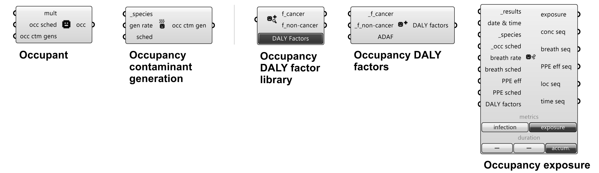

# Introduction to ANT components and CONTAM elements

ANT conponents are organized into 12 categories, each of which is represented by a tab in the ANT toolbar. The 12 categories are:
<!--ts-->
 - [01-Geometry](#01-Geometry)
    - [Zone](#zone)
    - [Door](#door)
    - [Window](#window)
    - [Orifice](#orifice)
    - [Generic opening](#generic-opening)
 - [02-HVAC](#02-HVAC)
    - [Air handling system (AHS)](#air-handling-system-(AHS))
    - [AHS Supply](#AHS-Supply)
    - [AHS Return](#AHS-Return)
 - [03-Filter](#03-Filter)
 - [04-Schedule](#04-Schedule)
 - [05-Species](#05-Species)
 - [06-Source/Sink](#06-Source/Sink)
 - [07-Occupancy](#07-Occupancy)
 - [08-Airflow](#08-Airflow)
 - [09-Library](#09-Library)
 - [10-Ambient](#10-Ambient)
 - [11-Simulation](#11-Simulation)
 - [12-Results](#12-Results)
<!--te-->
CONTAM elements are essential for creating CONTAM projects (PRJ) and are associated with ANT components and created by ANT components. The details of CONTAM elements can be found in CONTAM documents (e.g., [CONTAM User Guide](https://www.nist.gov/publications/contam-user-guide-and-program-documentation-version-34)). Some elements are introduced here for better understanding of ANT components.

## 01-Geometry

### Zone
Create zones.
 - **Inputs**:
    - **_zone** [required]:
        - Type: Brep geometry [List]
        - Default: None
        - Description: Zone geometry (brep) acquired from Rhino.
    - **temperature**: 
        - Type: Number / Week Schedule (temperature) [Item]
        - Default: 20 °C (constant)
        - Description: Zone temperature. Same input for all specified zones (in **_zone**). Unit can be changed by right-clicking the component and selecting the desired one.
            - Number input → Constant temperature over time.
            - Schedule input → Variable temperatures over time.
    - **init ctm conc**: 
        - Type: Number [List]
        - Default: 0 for all contaminants
        - Description: Initial concentrations of simulated contaminants (specified in [Project](###project) component). Must match the size of contaminant inputs in [Project](###project) component. Same input for all specified zones (in **_zone**).
    - **srcs/sinks**: 
        - Type: Source/Sink [List]
        - Default: None
        - Description: Source/Sink elements. Same input for all specified zones (in **_zone**).
    - **ahs sup/ret**: 
        - Type: Airflow path (AHS supply/return) [List]
        - Default: None
        - Description: Airflow paths of air handling system (AHS) supply/return elements that work in the zones. Same input for all specified zones (in **_zone**).
- **Outputs**:
    - **zones**:
        - Type: Brep geometry - [List]
        - Description: Brep geometry with updated settings.

### Door
Create doors.\
Each door by default contains an airflow path for the door (*two opening model* in two-way opening models) and an airflow path for the undercut (*orifice model* in one-way flow using powerlaw models).
- **Inputs**:
    - **_openings** [required]:
        - Type: Brep/surface geometry [List]
        - Default: None
        - Description: Door geometry (brep/surface) acquired from Rhino.
    - **wpp\:door**:
        - Type: Wind pressure profile [Item]
        - Default: None
        - Description: Wind pressure profile (WPP) for doors. Same input for all specified doors (in **_openings**). WPP is available only on exterior surfaces.
    - **ucut area**:
        - Type: Number [Item]
        - Default: Door width × default undercut thickness (1 in or 25.4 mm)
        - Description: Door undercut area. Same input for all specified doors (in **_openings**). 
    - **wpp:ucut**:
        - Type: Wind pressure profile [Item]
        - Default: None
        - Description: Wind pressure profile (WPP) for door undercuts. Same input for all undercuts of specified doors (in **_openings**).
    - **sched**:
        - Type: Week schedule (dimensionless) [Item]
        - Default: None
        - Description: Week schedule that controls the airflow paths doors. Same input for all specified doors (in **_openings**). Only available for airflow paths of doors (not working on undercut airflow paths).
- **Outputs**:
    - **openings**:
        - Type: Brep/surface geometry [List]
        - Description: Door geometry (brep/surface) with updated settings.
        
### Window
Create windows.\
Each window by default contains an airflow path. If the window is an openable window (with input on **sched**), a *two opening model* in two-way opening models is applied to the window. If the window is a fixed window (without input on **sched**), an *one opening model* in two-way opening models is applied.
- **Inputs**:
    - **_openings** [required]:
        - Type: Brep/surface geometry [List]
        - Default: None
        - Description: Window geometry (brep/surface) acquired from Rhino.
    - **wpp**:
        - Type: Wind pressure profile [Item]
        - Default: None
        - Description: Wind pressure profile (WPP) for windows. Same input for all specified windows (in **_openings**). WPP is available only on exterior surfaces.
    - **sched**:
        - Type: Week schedule (dimensionless) [Item]
        - Default: None
        - Description: Week schedule that controls the airflow paths of windows. Same input for all specified windows (in **_openings**). Only available for airflow paths of openable windows (not working on fixed windows).
- **Outputs**:
    - **openings**:
        - Type: Brep/surface geometry [List]
        - Description: Window geometry (brep/surface) with updated settings.

### Orifice
Create orifices.\
Each orifice by default contains an airflow path of the orifice (*orifice model* in one-way flow using powerlaw models).
- **Inputs**:
    - **_openings** [required]:
        - Type: Brep/surface geometry [List]
        - Default: None
        - Description: Orifice geometry (brep/surface) acquired from Rhino.
    - **wpp**:
        - Type: Wind pressure profile [Item]
        - Default: None
        - Description: Wind pressure profile (WPP) for orifices. Same input for all specified orifices (in **_openings**). WPP is available only on exterior surfaces.
    - **sched**:
        - Type: Week schedule (dimensionless) [Item]
        - Default: None
        - Description: Week schedule that controls the airflow paths of orifices. Same input for all specified orifices (in **_openings**).
- **Outputs**:
    - **openings**:
        - Type: Brep/surface geometry [List]
        - Description: Orifice geometry (brep/surface) with updated settings.

### Generic opening
Create generic openings.\
Each generic opening contains an airflow path defined in **_path**. For openings with *fan and forced-flow models*, airflow direction is visualized and can be changed by right-clicking the component and reverse the flow direction.
- **Inputs**:
    - **_openings** [required]:
        - Type: Brep/surface geometry [List]
        - Default: None
        - Description: Generic opening geometry (brep/surface) acquired from Rhino.
    - **_path** [required]:
        - Type: Airflow path [Item]
        - Default: None
        - Description: Airflow path of generic openings. Same input for all specified generic openings (in **_openings**).
- **Outputs**:
    - **openings**:
        - Type: Brep/surface geometry [List]
        - Description: Generic opening geometry (brep/surface) with updated settings.

## 02-HVAC

### Air handing system (AHS)
Create air handling systems (AHS).\
A simple AHS with a default name of "\_ahs\_?" is created, where "?" is the number of AHS created (AHS components that created).
- **Inputs**:\
    ── Out Air ──
    - **min OA**:
        - Type: Number [Item]
        - Default: 0
        - Description: Minimum outdoor air introduced to the AHS supply flow (mass flow rate). Unit can be changed by right-clicking the component and selecting the desired one.
    - **intake loc**:
        - Type: Number [List]
        - Default: 0, 0, 0
        - Description: Outdoor air intake location. Must be a list of 3 numbers, i.e., X, Y, Z coordinates, respectively. Required only when using a WPC file.
    - **sched**:
        - Type: Week schedule (dimensionless) [Item]
        - Default: None
        - Description: Week schedule that controls the outdoor air intake.

    ── Supply ──
    - **volume**:
        - Type: Number [Item]
        - Default: 0
        - Description: Volume of the supply sub-system (implicit return zone) of the simple AHS (e.g., supply-side duct work etc.). This volume is similar to a zone volume and will be used in the simulation of contaminant transport.
    - **init ctm conc**: 
        - Type: Number [List]
        - Default: 0 for all contaminants
        - Description: Initial concentrations of simulated contaminants (specified in [Project](###project) component) for the supply sub-system of the simple AHS. Must match the size of contaminant inputs in [Project](###project) component.
    
    ── Return ──
    - **volume**:
        - Type: Number [Item]
        - Default: 0
        - Description: Volume of the return sub-system (implicit return zone) of the simple AHS (e.g., return-side duct work etc.). This volume is similar to a zone volume and will be used in the simulation of contaminant transport.
    - **init ctm conc**: 
        - Type: Number [List]
        - Default: 0 for all contaminants
        - Description: Initial concentrations of simulated contaminants (specified in [Project](###project) component) for the return sub-system of the simple AHS. Must match the size of contaminant inputs in [Project](###project) component.
    
    ── Filters ──
    - **OA filter**:
        - Type: Filter element [Item]
        - Default: None
        - Description: Outdoor air filter which affects the air brought in by the simple AHS from outside the building.
    - **Rec filter**:
        - Type: Filter element [Item]
        - Default: None
        - Description: Recirculation air filter which affects the return air being circulated back through the simple AHS.
- **Outputs**:
    - **ahs**:
        - Type: Air handling system [Item]
        - Description: Air handling system (AHS) with updated settings.

### AHS Supply
Create AHS supply.
- **Inputs**:
    - **_ahs** [required]:
        - Type: Air handling system [Item]
        - Default: None
        - Description: AHS to which the supply is connected.
    - **flow**:
        - Type: Airflow path [Item]
        - Default: 0
        - Description: Design flow rate of supply air (mass flow rate). Unit can be changed by right-clicking the component and selecting the desired one.
    - **sched**: 
        - Type: Week schedule (dimensionless) [Item]
        - Default: None
        - Description: Week schedule that controls the supply air.
    - **filter**:
        - Type: Filter element [Item]
        - Default: None
        - Description: Filter that affects the supply air.
- **Outputs**:
    - **supply**:
        - Type: Airflow path (AHS supply) [Item]
        - Description: Airflow path of AHS supply element with updated settings.

### AHS Return
Create AHS return.
- **Inputs**:
    - **_ahs** [required]:
        - Type: Air handling system [Item]
        - Default: None
        - Description: AHS to which the return is connected.
    - **flow**:
        - Type: Airflow path [Item]
        - Default: 0
        - Description: Design flow rate of return air (mass flow rate). Unit can be changed by right-clicking the component and selecting the desired one.
    - **sched**: 
        - Type: Week schedule (dimensionless) [Item]
        - Default: None
        - Description: Week schedule that controls the return air.
    - **filter**:
        - Type: Filter element [Item]
        - Default: None
        - Description: Filter that affects the return air.
- **Outputs**:
    - **return**:
        - Type: Airflow path (AHS return) [Item]
        - Description: Airflow path of AHS return element with updated settings.

## 03-Filter

### Filter element
### Filter efficiency data - Constant efficiency
### Filter efficiency data - Simple gaseous
### Filter efficiency data - Simple particle
### Filter efficiency data - UVGI

## 04-Schedule

## 05-Species

## 06-Source/Sink

## 07-Occupancy

## 08-Airflow

## 09-Library

## 10-Ambient

## 11-Simulation

### Project
### Simulation parameters
### Simulation
### Help
## 12-Results
