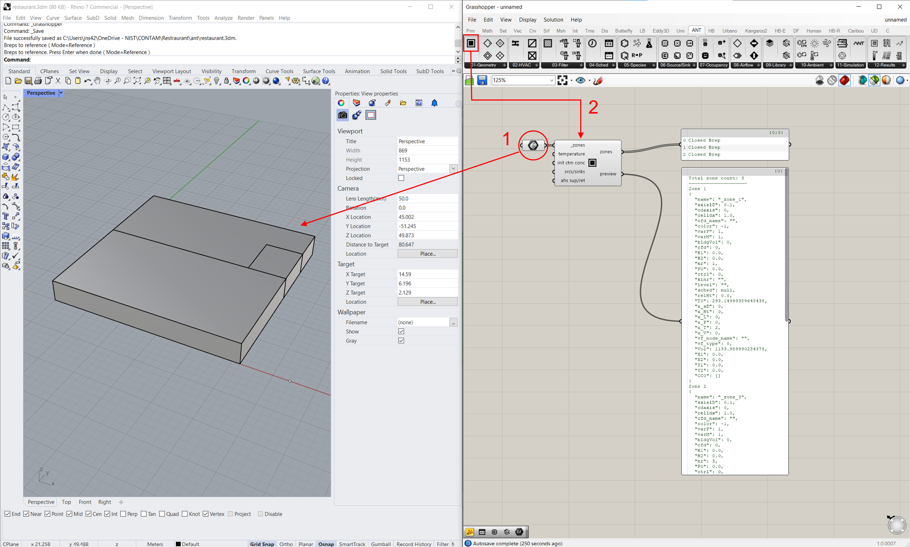
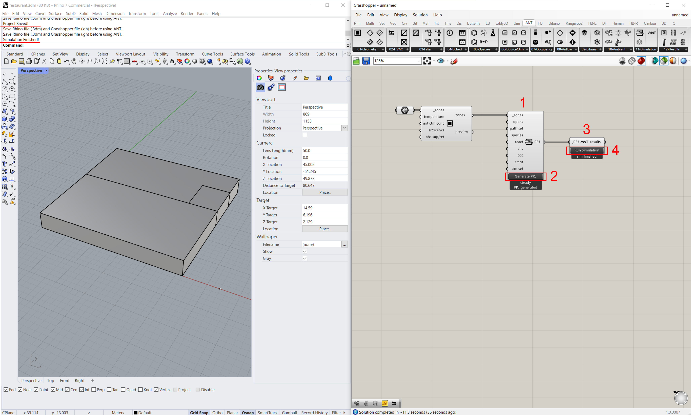

# Basic settings and creating zones

<!--ts-->
 - [Basic settings](#basic-settings)
    - [Launching ANT](#launching-ant)
      - [1. Launch Rhino and Grasshopper](#1-launch-rhino-and-grasshopper)
      - [2. Save documents before you start](#2-save-documents-before-you-start)
      - [3. Start ANT](#3-start-ant)
    - [Unit settings](#unit-settings)
 - [Creating zones](#creating-zones)
    - [Generating geometries in Rhino](#generating-geometries-in-rhino)
      - [1. Generate BREP geometries](#1-generate-brep-geometries)
      - [2. Zone and surface information](#2-geometry-information)
      - [3. Surface types](#3-surface-types)
    - [Creating zones in Grasshopper](#creating-zones-in-grasshopper)
      - [1. Create zones](#1-create-zones)
      - [2. View outputs](#2-view-outputs)
 - [Creating a project and running a simulation](#creating-a-project-and-running-a-simulation)
<!--te-->

This section introduces the basic settings of ANT and how to build geometries in Rhino, create associated zones, and generate a simple project with assigned zones and run the simulation. 

Foundamental knowledge on Rhino and Grasshopper is required before using ANT. If you are a beginner of Rhino and Grasshopper, I believe you can find numerous tutorials on the Internet. There are some tutorials on the official sites of Rhino and Grashopper, i.e. [Rhino tutorials](https://www.rhino3d.com/tutorials) and [Grasshopper tutorials](https://www.grasshopper3d.com/page/tutorials-1). I found [this manual (The Grasshopper Primer)](https://modelab.gitbooks.io/grasshopper-primer/content/) published by [ModeLab](https://www.modelab.design/) is very helpful for beginners. You can also find many tutorials on YouTube.

## Basic settings
### Launching ANT
After you successfully installed Rhino and ANT on your computer ([how to install ANT?](../README.md#installation)). You are ready to run ANT on Rhino Grasshopper. 

#### 1. Launch Rhino and Grasshopper
 > Launch Rhino

If you use Rhino 6 or newer, Grasshopper is already included in yout Rhino.

 > Launch Grasshopper
 > - Click the Grasshopper icon on the Standard Toolbar,
 > - Type `Grasshopper` in the Command line of Rhino and press Enter, or
 > - Click `Tools` on the menu bar and click `Grasshopper`.

The Grasshopper window will appear. You are ready to find and use ANT there.

#### 2. Save documents before you start
**Always save your Rhino and Grasshopper documents before you start using ANT**. Some components in ANT may require the document file names and paths to work properly. Without saving your files, your ANT project may not work as expected. The Rhino document is in `.3dm` format and the Grasshopper document is in `.gh` format. You can save them in the same folder.

 > Save Rhino file
 > - Click `File` on the menu bar of Rhino and click `Save` or `Save As...`.
 
 > Save Grasshopper file
 > - Click `File` on the menu bar of Grasshopper and click `Save Document` or `Save Document As...`

#### 3. Start ANT
If ANT is successfully installed, you can find it in the `ANT` tab in Grasshopper. If you cannot find the `ANT` tab, please check if you have installed ANT correctly ([how to install ANT?](../README.md#installation)).

### Unit settings
Before you create your first geometry and ANT element, you need to set the length unit of your Rhino document. The unit will be used as the default length unit throughout your ANT project, except for the particle diameter unit, which takes micrometer (µm). It is not recommended to change the length unit after you start creating your ANT project unless you manually update all existing ANT components on the canvas.

 > Set Rhino units
 > 1. Click `Tools` on the menu bar of Rhino and click `Options...`, or type `Options` in the Command line of Rhino and press Enter, or click the Options icon on the Standard Toolbar in Rhino,
 > 2. Under `Document Properties`, click `Units`,
 > 3. Select the units you want to use in the `Model units` drop-down list,
 > 4. Click `OK` to close the `Rhino Options` window.

## Creating zones
### Generating geometries in Rhino
#### 1. Generate BREP geometries
Generate boundary representation (BREP) geometries in Rhino. The BREP geometries represent the spaces you would like to simulate in your project. Each BREP geometry represent a single space. Please do not generate geometries with overlapped spaces. You can use any Rhino commands or Grasshopper components to generate geometries. It has to be noted that ANT only supports BREP geometries to be defined as its zones. Other types of geometries, such as meshes, are not supported.

Although BREP geometries with all possible shapes can be generated in Rhino and used by ANT, it is recommended to generate geometries with simple shapes, which means geometries enclosed by flat surfaces. Complex geometries, such as those with curved surfaces, may not be supported by the current version of ANT. Therefore, it is suggested to simply the geometries of your simulated spaces before connect them with ANT components.

#### 2. Geometry information
The geometry information of zones and surfaces, including zone volume, centroid location, surface area, surface orientation, etc., are automatically determined by ANT. 

#### 3. Surface types
The surface types are used to define the boundary conditions of the zones. Different boundary conditions can be assigned with different airflow paths.

 - **Ceiling / Floor / Wall**: The type of surfaces on the BREP geometries are assigned automatically by ANT according to their geometry and connection with other surfaces. The bottom surface of a BREP geometry is always assigned as a floor surface. Floor surfaces have to be flat and parallel to the ground plane (typically, X-Y plane). The top surface of a BREP geometry is always assigned as a ceiling surface. Ceiling surfaces can be flat and parallel to the ground plane. They can also be tilted surfaces with a tilting angle less than 45°, which can be used to represent pitch roofs. The other surfaces are assigned as wall surfaces. 
 - **Interior / Exterior**: The interior and exterior surfaces are assigned automatically by ANT according to their connection with other surfaces. The surfaces that are not connected with other surfaces are assigned as exterior surfaces. The surfaces that are connected with other surfaces are assigned as interior surfaces.

### Creating zones in Grasshopper
#### 1. Create zones
CONTAM/ANT zones will be generated by the [**Zone**](./0%20-%20Introduction%20to%20ANT%20components%20and%20CONTAM%20elements.md#zone) component in Grasshopper. The ANT zones need to be associated with the BREP geometries created in Rhino. 

 > Create zones in Grasshopper
 > 1. Select and drag the `Brep` component in Grasshopper (`Params` > `Geometry` > `Brep`) to the Grasshopper canvas, and right click the `Brep` component and click `Set One Brep` or `Set Multiple Breps` to select the desired BREP geometries on Rhino canvas to assign them to the `Brep` component,
 > 2. Select and drag the [**Zone**](./0%20-%20Introduction%20to%20ANT%20components%20and%20CONTAM%20elements.md#zone) component in Grasshopper (`ANT` > `01-Geometry` > `Zone`) to the Grasshopper canvas, and connect the `Brep` output to the `_brep` input of the [**Zone**](./0%20-%20Introduction%20to%20ANT%20components%20and%20CONTAM%20elements.md#zone) component.

CONTAM/ANT zones with default settings will be generated by the [**Zone**](./0%20-%20Introduction%20to%20ANT%20components%20and%20CONTAM%20elements.md#zone) component. The zone names are assigned automatically by ANT as `_zone_1`, `_zone_2`, etc. The zone names can be visualized by using the [**Day Schedule**](./0%20-%20Introduction%20to%20ANT%20components%20and%20CONTAM%20elements.md#day-schedule) component through right-clicking the component and selecting the `visualize zone names` option. 

If multiple BREP geometries are selected and assigned to the [**Zone**](./0%20-%20Introduction%20to%20ANT%20components%20and%20CONTAM%20elements.md#zone) component, same zone settings that are defined by the component (e.g., temperature, initial contaminant concentrations, contminant sources and sinks, and AHS supplies and returns) will be applied to all selected BREP geometries. If you want to assign different settings to different BREP geometries, you need to create multiple [**Zone**](./0%20-%20Introduction%20to%20ANT%20components%20and%20CONTAM%20elements.md#zone) components and assign different BREP geometries to them.

#### 2. View outputs
The output `zones` of the [**Zone**](./0%20-%20Introduction%20to%20ANT%20components%20and%20CONTAM%20elements.md#zone) component contains the selected BREP geometries with assigned information. Zone information can be previewed in the `preview` output of the [**Zone**](./0%20-%20Introduction%20to%20ANT%20components%20and%20CONTAM%20elements.md#zone) component.

## Creating a project and running a simulation

 > Create a project and run a simulation
 > 1. Select and drag the [**Project**](./0%20-%20Introduction%20to%20ANT%20components%20and%20CONTAM%20elements.md#project) component in Grasshopper (`ANT` > `11-Simulation` > `Project`) to the Grasshopper canvas, and and connect the `zones` output of the [**Zone**](./0%20-%20Introduction%20to%20ANT%20components%20and%20CONTAM%20elements.md#zone) component to the `_zones` input of the [**Project**](./0%20-%20Introduction%20to%20ANT%20components%20and%20CONTAM%20elements.md#project) component,
 > 2. Click the `Generate PRJ` button on the [**Project**](./0%20-%20Introduction%20to%20ANT%20components%20and%20CONTAM%20elements.md#project) component to generate a CONTAM project file (`.PRJ`) with default settings (steady simulation with default airflow path settings) in the specified location (a message of `PRJ generated` will appear if the PRJ file is generated successfully),
 > 3. Select and drag the [**Simulation**](./0%20-%20Introduction%20to%20ANT%20components%20and%20CONTAM%20elements.md#simulation) component in Grasshopper (`ANT` > `11-Simulation` > `Simulation`) to the Grasshopper canvas, and connect the `PRJ` output of the [**Project**](./0%20-%20Introduction%20to%20ANT%20components%20and%20CONTAM%20elements.md#project) component to the `_PRJ` input of the [**Simulation**](./0%20-%20Introduction%20to%20ANT%20components%20and%20CONTAM%20elements.md#simulation) component,
 > 4. Click the `Run Simulation` button on the [**Simulation**](./0%20-%20Introduction%20to%20ANT%20components%20and%20CONTAM%20elements.md#simulation) component to run the simulation for the imported PRJ file. The simulation results will be saved in the same folder as the PRJ file. A message of `sim finished` will appear if the simulation is finished successfully.

When the project is generated and the simulation is finished, you can check the PRJ file and the associated results files (e.g., SIM and SQLITE3) in the specified folder. You can visualize the simulation results in ANT as well. It will be introduced in later tutorials.